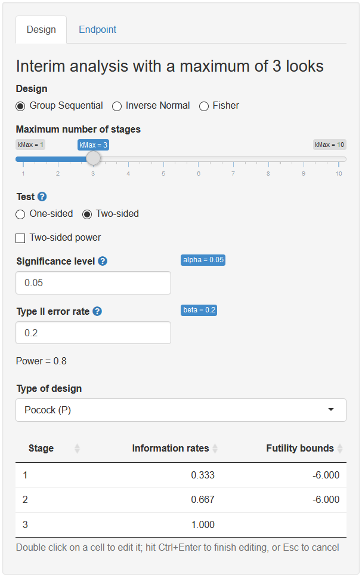
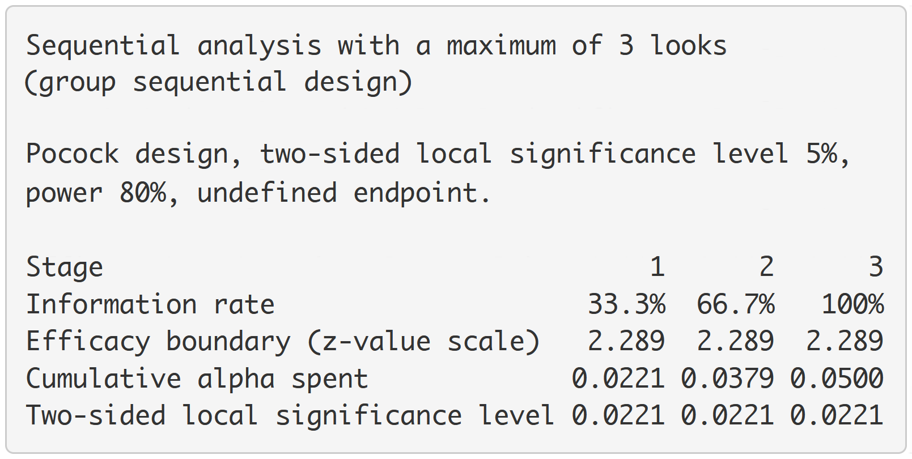

```{r setup, include = FALSE}
library(rpact)
library(papaja)
options(scipen = 999, digits = 3)
knitr::opts_chunk$set(error = FALSE, warning = FALSE)
```

Sequential analyses are a more efficient approach to hypothesis testing than analyzing data only once after the maximum sample size has been collected. The reason is that the sample size of the study is expected to be smaller under many circumstances due to the possibility of rejecting the null hypothesis or stopping the study for futility at an interim look. Even though all researchers have resource constraints, and despite the popularity of sequential designs in fields such as medicine, most researchers in other disciplines are not yet benefiting from the efficiency gains that sequential designs provide. One possible reason for this slow adoption of a statistical technique that saves substantial resources might have been a lack of statistical software tools to easily design a study that uses sequential analyses [@albers_problem_2019]. In recent years, however, R packages have been created that make it relatively easy for all researchers to plan and analyze group sequential designs. In this tutorial, we will illustrate how to design and report a sequential analysis with easy to use statistical software.

Sequential analyses have a long history. Dodge and Romig -@dodge_method_1929 already realized that analyzing data sequentially was more efficient than doing so only once. Wald popularized the idea of sequential tests of hypotheses during the second world war. He was only allowed to publish his findings after the war had ended [@wald_sequential_1945], as he explains in a historical note (p. 121): 

>*Because of the substantial savings in the expected number of observations effected by the sequential probability ratio test, and because of the simplicity of this test procedure in practical applications, the National Defense Research Committee considered these developments sufficiently useful for the war effort to make it desirable to keep the results out of the reach of the enemy, at least for a certain period of time. The author was, therefore, requested to submit his findings in a restricted report which was dated September, 1943.*

In other words, sequential analyses provide such an increased efficiency when testing hypotheses that the technique could not be shared with the enemy during the war - yet few researchers outside of medicine currently use it, even though they can. Sequential analyses are established procedures, and have been developed in great detail over the last decades [@proschan_statistical_2006; @jennison_group_2000; @wassmer_group_2016]. Just as in designs where the final sample size is fixed in advance (i.e., *fixed designs*), researchers specify their Type I and Type II error rates and design a well-powered study where the error rates are controlled. As opposed to fixed designs, researchers have the freedom to choose how they will spend their error rate across multiple looks at the data.

In a sequential design, researchers plan to collect data, analyze the results, and depending on whether or not the results are statistically significant, they will continue the data collection. If one would analyze the data repeatedly as data comes in without correcting the alpha level (or significance level), the Type I error rate will substantially inflate [@armitage_repeated_1969]. For example, as Armitage and colleagues show, when analyzing results 5 times (when collecting the same number of observations for each look at the data) the alpha level inflates to 0.142 instead of 0.05. Researchers admit to having used *optional stopping* without adjusting the alpha level [@fiedler_questionable_2016; @john_measuring_2012]. The idea that repeatedly analyzing data increases the efficiency of data collection is correct, but the past practice to use optional stopping is flawed. When done right, sequential designs give researchers more flexibility and increase the efficiency of data collection while controlling Type I and Type II error rates.

When moving from a fixed design to a sequential design researchers need to make several decisions. The first decision is how the error rates should be controlled across multiple looks at the data. The second decision is whether the data collection is stopped when there is no support for the alternative hypothesis, and if so, which rule is used to make such a decision. After making both decisions it is possible to perform an a-priori power analysis to determine the sample size required for the sequential design. It is then straightforward to compute the average sample size that one can expect to collect, based on the statistical power at each look, and the probability that the data collection will stop at each look. Finally, at the last look researchers can report an effect size estimate, confidence interval, and *p* value that takes the sequential nature of the design into account. In this tutorial we explain each of these steps. A detailed step-by-step vignette that illustrates how to perform all calculations presented in this tutorial both in `rpact` as in the online Shiny app is available at https://www.rpact.org/vignettes/step-by-step_tutorial.

## Type I Error Control in Sequential Designs

Imagine a researcher who will collect data from at most 188 participants and plans to analyze the data after 66, 132, and 188 participants are recruited into the study. Each analysis is called a look. In this example, the looks at the data are spaced equally, which means they occur after the same number of participants have been collected between each look. There are in total $K = 3$ looks at the data, with two interim analyses, and one final analysis (so tests are performed after 33.3%, 66.7%, and 100% of the data is collected). Not all looks have to occur in practice. If the analysis reveals a statistically significant result after look 1, data collection can be terminated. It is also possible to stop the data collection at look 1 because the observed effect is much smaller than the effect size that the study was designed to detect, and the presence of effects as large or larger than the effect size of interest can be rejected. This is called stopping for futility.

The solution to controlling the Type I error inflation in sequential analyses is conceptually similar to a multiple comparison problem. Because multiple tests are performed, the Type I error rates inflates. By lowering the alpha level at each look, the overall Type I error rate can be controlled. This is much like a Bonferroni correction, and indeed, the Bonferroni correction is a valid (but conservative) approach to control the error rate in sequential analyses [@wassmer_group_2016]. If researchers do not have the time to learn about sequential designs, they can simply preregister studies where they plan to perform a Bonferroni correction for each look. However, a better understanding of group sequential designs will provide researchers with a lot more flexibility and increased efficiency.

In sequential designs the analysis at each look includes all data collected thus far. At look 2 we combine the data collected at look 1 with the new data. This implies that the statistical tests at each looks are not independent. Instead, sequential tests for a continuous endpoint have a well-known multivariate normal distribution with calculable probabilities. This makes it possible to derive adjusted alpha levels that control the Type I error rate more efficiently than a Bonferroni correction. The simplest way to correct the alpha level is the Pocock correction [@pocock_group_1977], where an alpha level is chosen that is the same for each look. For example, if we want an overall Type I error rate of 5%^[The alpha level for any test should be carefully justified. In this tutorial we use an alpha level of 0.05 throughout to prevent confusion between the chosen alpha level and adjusted alpha levels at different looks.] for a two-sided test with 1 interim analysis (and one final look), the alpha level for each look would be 0.0294, for three looks in total the alpha level would be 0.0221, for four looks it would be 0.0182, and for five looks it would be 0.0158^[Corrected alpha levels can  be computed to many digits, but this quickly reaches a level of precision that is meaningless in real life. The observed Type I error rate for all tests you will do in your lifetime is not noticeably different if you set the alpha level at 0.0158 or 0.016.]. We see the correction is slightly more efficient than using a Bonferroni correction (in which case the alpha levels would be 0.025, 0.0167, 0.0125, and 0.01, respectively). Applying the Pocock procedure in this way requires 1) specifying the number of looks in advance, and 2) equally spaced looks. This second requirement can be weakened by requiring that the number of subjects per look is fixed in advance and cannot be changed during the course of the study. 

In this tutorial the R [@r_2020] package `rpact` will be used [@wassmer_rpact_2019]. Many of the options in the package are also available in an online Shiny [@shiny_app_2020] app: https://shiny.rpact.com. As Figure \@ref(fig:screenshot-1) shows researchers can specify the number of looks, whether they plan to perform a one-sided or two-sided test, the overall alpha level, and the type of design (e.g., a design using the Pocock correction). The `rpact` Shiny app computes the significance level for each look (reported as the "Two-sided local significance level" in Figure \@ref(fig:output-1)) and provides the R code to reproduce the computations (see Figure \@ref(fig:output-2)). In addition, the Shiny app can be used to generate plots, tables, and reports in Rmd, pdf, html, and xlsx formats.

```{r screenshot-1, echo=FALSE, fig.cap="Screenshot of the design tab of the rpact Shiny app.", out.width = "240px"}

```

```{r, include = FALSE}
design <- getDesignGroupSequential(
  kMax = 3,
  typeOfDesign = "P",
  sided = 2,
  alpha = 0.05,
  beta = 0.2
)
summary(design)
```

```{r output-1, fig.cap="Summary output of the rpact Shiny app for the design specified in Figure 1.", out.width = "240px"}

```

```{r output-2, fig.cap="R command output of the rpact Shiny app.", out.width = "240px"}
knitr::include_graphics("seq_images/output_2.png")
```

## Comparing Corrections

The Pocock correction is one way to control the alpha level across all looks such that the alpha level is identical for each look at the data, resulting in constant critical values (expressed as *z* values) $u_k = c$ to reject the null hypothesis, $H_0$, at look $k$. Other solutions distribute the Type I error rate across looks in different ways. For example, the O'Brien and Fleming correction [@obrien_multiple_1979] uses monotonically decreasing values $u_k = c/\sqrt{k}$, i.e., as $c$ is found (through a numerical algorithm), the critical values $u_k$ can be derived. Here, a higher threshold for early looks is foreseen, but the final look occurs quite close to the uncorrected alpha level (see Figure \@ref(fig:spending-comparison) for a visualization of the critical *z* values for three equally spaced looks for different ways to spend the Type I error rate across looks). The Haybittle and Peto correction simply suggests to use a critical value of $u$ = 3 for each look but the last, $u_K$, which is corrected to control the overall error rate (and is very close to the uncorrected critical value). 

Because the statistical power of a test depends on the alpha level (and the effect size and the sample size), and because the alpha level for an O'Brien and Fleming or a Haybittle and Peto design is close to alpha level for a fixed design with only one look, at the final look the statistical power of these designs is also similar to the power for a fixed design. However, there is a reasonable chance (especially for the O'Brien and Fleming design) to stop the study early and thereby gain efficiency. If the alpha level for the final look is lowered, the sample size of a study needs to be increased to maintain the same statistical power at the last look. Because the Pocock correction leads to a lower alpha level at the last look, this design requires a larger increase in the maximum sample size than the O'Brien and Fleming or the Haybittle and Peto correction. This increase in sample size when using the Pocock correction is compensated by an increased chance to stop the data collection at an earlier look. We will discuss these issues in more detail in the section on sample size planning. 

Another approach to controlling Type I error rates is provided by @wang_approximately_1987, where a power parameter $\Delta$ is specified which determines the shape of the critical values over the looks as given by $u_k = k^{\Delta - 0.5}$. With $\Delta$ = 0 the Wang and Tsiatis correction equals the O'Brien and Fleming correction, and with $\Delta$ = 0.5 the Wang and Tsiatis correction equals the Pocock correction. For  $0 < \Delta < 0.5$ it is possible to select the shape of decision boundaries somewhere in between these two corrections. 

```{r spending-comparison, fig.margin=FALSE, echo=FALSE, fig.cap="Comparison of critical values (in $z$ values) for the O'Brien and Fleming, Pocock, Wang and Tsiatis with $\\Delta$ = 0.25, and Haybittle-Peto corrections for 3 looks."}

d1 <- getDesignGroupSequential(typeOfDesign = "OF", sided = 2, kMax = 3, alpha = 0.05) 
d2 <- getDesignGroupSequential(typeOfDesign = "P", sided = 2, kMax = 3, alpha = 0.05)
d3 <- getDesignGroupSequential(typeOfDesign = "WT", deltaWT = 0.25, sided = 2, kMax = 3, alpha = 0.05)
d4 <- getDesignGroupSequential(typeOfDesign = "HP", sided = 2, kMax = 3, alpha = 0.05)

designSet <-getDesignSet(designs = c(d1, d2, d3, d4), variedParameters = "typeOfDesign")

plot(designSet, type = 1, legendPosition = 2)
```

We can see that the O'Brien and Fleming correction is much more conservative at the first look, and close to the uncorrected critical value of 1.96 (the black dashed line - for two-sided tests all critical values are mirrored in the negative direction) at the last look: `r format(d1$criticalValues[1], digits = 4)`, `r format(d1$criticalValues[2], digits = 4)`, and `r format(d1$criticalValues[3], digits = 4)`. The Pocock correction has the same critical value at each look (`r format(d2$criticalValues[1], digits = 4)`, `r format(d2$criticalValues[2], digits = 4)`, and `r format(d2$criticalValues[3], digits = 4)`), the Haybittle and Peto correction has the same critical value at each look but the last (`r format(d4$criticalValues[1], digits = 4)`, `r format(d4$criticalValues[2], digits = 4)`, and `r format(d4$criticalValues[3], digits = 4)`), while the critical values decrease for each look with the Wang and Tsiatis correction (`r format(d3$criticalValues[1], digits = 4)`, `r format(d3$criticalValues[2], digits = 4)`, and `r format(d3$criticalValues[3], digits = 4)`).


## The Alpha Spending Approach

The approaches to specify the shape of decision boundaries across looks discussed so far have an important limitation [@proschan_statistical_2006]. They require a pre-specified number of looks (e.g., 4), and the sample size for the interim looks need to be pre-specified as well (e.g., after 25%, 50%, 75%, and 100% of observations). It is logistically not always feasible to stop the data collection exactly at 25% of the planned total sample size. For example, due to inclusion criteria (such as a minimum accuracy level on an experimental task) some observations will excluded from the final analysis, but the number of observations that will be excluded is not known until the data is analyzed. An important contribution to the sequential testing literature was made by Lan and DeMets -@lan_discrete_1983 who introduced the alpha spending approach. In this approach the cumulative Type I error rate spent across the looks is pre-specified through a function (the *alpha spending function*) in order to yield overall significance level $\alpha$ at the end of the study. For the O'Brien and Fleming approach only a small amount of the Type I error rate is spent for early looks and more is spent on later looks, while for a Pocock design a more uniform spending of $\alpha$ over the looks is anticipated. The idea is of the alpha spending approach is to calculate the critical values (and correspondingly, the alpha levels) at each look according to the prespecified alpha spending function that depends on the fraction of information available at some time point, $t$, of the study. The monotone increasing alpha spending function is 0 at the beginning of the study ($t=0$) and it is $\alpha$ at the end ($t=1$). Lan and Demets showed that the critical values derived from the two functions
\begin{align*}
\alpha_1^*(t)&=
 \begin{cases}
 2\,(1-\Phi(\Phi^{-1}(1-\alpha/2)/\sqrt{t})) &\hbox{(one-sided case)}\\%
 4\,(1-\Phi(\Phi^{-1}(1-\alpha/4)/\sqrt{t})) &\hbox{(two-sided case)}%
\end{cases}\\[-3mm]
 \intertext{and}
 \alpha_2^*(t)&=\alpha \ln(1+(e-1) t)
\end{align*}
approximate Pocock's and O'Brien and Fleming's group sequential boundaries, respectively, in case of equally sized looks. In Figure \@ref(fig:spending-comparison-2) the O'Brien and Fleming-like critical values derived from the alpha spending function $\alpha_1^*(t)$ is plotted against the discrete O'Brien and Fleming bounds. We see that the two approaches are not identical, but they are very comparable. Similarly, we see that for Pocock's design, $\alpha_2^*(t)$ yields nearly constant critical values which are very similar to the Pocock correction. 

```{r spending-comparison-2, fig.margin=FALSE, echo=FALSE, fig.cap="Comparison of the Pocock (P) and O'Brien and Fleming (OF) corrections with the critical values derived from their corresponding alpha spending functions (asP and asOF) for a two-sided test with three looks."}
# Pocock correction
d1 <- getDesignGroupSequential(typeOfDesign = "P", kMax = 3, sided = 2)
# Pocock-like continuous spending function
d2 <- getDesignGroupSequential(typeOfDesign = "asP", kMax = 3, sided = 2)
#O'Brien and Fleming
d3 <- getDesignGroupSequential(typeOfDesign = "OF", kMax = 3, sided = 2) 
# OF-like continuous spending function
d4 <- getDesignGroupSequential(typeOfDesign = "asOF", kMax = 3, sided = 2)

designSet <-getDesignSet(designs = c(d1, d2, d3, d4), 
  variedParameters = "typeOfDesign")
plot(designSet, type = 1, legendPosition = 2)
```

The main benefit of these spending functions is that error rates at interim analyses can be controlled, while neither the number nor the timing of the looks needs to be specified in advance.^[Previous articles on sequential analyses such as @schnuerch_controlling_2020 and @schonbrodt_sequential_2017 have incorrectly claimed that the number of looks in group sequential designs needs to be specified in advance.] This makes alpha spending approaches much more flexible than earlier approaches to controlling the Type 1 error in group sequential designs. When using an alpha spending function it is important that the decision to perform an interim analysis is not based on collected data, as this can still increase the Type I error rate. As long as this assumption is met, it is possible to update the alpha levels at each look during a study.

## Updating Boundaries During a Study

```{r}
design <- getDesignGroupSequential(
  kMax = 3,
  typeOfDesign = "asP",
  sided = 2,
  alpha = 0.05,
  beta = 0.1
)
# summary(design)

# Initial sample size calculation
sampleSizeResult <- getSampleSizeMeans(
  design = design,
  groups = 2,
  alternative = 0.5,
  stDev = 1
)

# Summarize design
# summary(sampleSizeResult)
```

Although alpha spending functions control the Type I error rate even when there are deviations from the pre-planned number of looks, or their timing, this does require recalculating the boundaries used in the statistical test based on the amount of information that has been observed. Let us assume a researcher designs a study with three equally spaced looks at the data ($K = 3$), using a Pocock-type alpha spending function $\alpha_2^*(t)$, where results will be analyzed in a two-sided *t*-test with an overall desired Type I error rate of 0.05, and a desired power of 0.9 for a Cohen's *d* of 0.5. An a-priori power analysis shows that we achieve the desired power in our sequential design if we plan to look after `r ceiling(sampleSizeResult$numberOfSubjects1)` observations in each condition. 

```{r}

# compute actual looking time
actual_look_time <- (2*(ceiling(sampleSizeResult$numberOfSubjects1)[1]+5))/(2* (ceiling(sampleSizeResult$numberOfSubjects1)[3])) 

seq_design_2 <- getDesignGroupSequential(
  sided = 2,
  kMax = 3,
  alpha = 0.05,
  beta = 0.1,
  informationRates = c(actual_look_time, 2/3, 1),
  typeOfDesign = "asP"
)

# summary(seq_design_2)

# Update power analysis

power_update_1 <- getPowerMeans(
  design = seq_design_2,
  groups = 2,
  alternative = 0.5, 
  stDev = 1, 
  allocationRatioPlanned = 1,
  maxNumberOfSubjects = 196, 
  normalApproximation = FALSE)

# summary(power_update_1)

```

Now imagine that due to logistical issues, we do not have the ability to analyze the data until we have collected data from `r ceiling(sampleSizeResult$numberOfSubjects1)[1]+5` instead of `r ceiling(sampleSizeResult$numberOfSubjects1)[1]` observations per condition. So our first look at the data does not occur at 33.33% of planned sample, but at `r 2*(ceiling(sampleSizeResult$numberOfSubjects1)[1]+5)`  /`r 2* (ceiling(sampleSizeResult$numberOfSubjects1)[3])` = `r 100*(2*(ceiling(sampleSizeResult$numberOfSubjects1)[1]+5))/(2* (ceiling(sampleSizeResult$numberOfSubjects1)[3]))`% of the planned sample. We can recalculate the alpha levels we should use for each look at the data, based on the current look, and planned future looks. Instead of using the alpha levels `r format((2*design$stageLevels[1]), nsmall = 4)`, `r format((2*design$stageLevels[2]), nsmall = 4)`, and `r format((2*design$stageLevels[3]), nsmall = 4)` at the three respective looks, the updated alpha levels are `r format((2*seq_design_2$stageLevels[1]), nsmall = 4)` for the current look, `r format((2*seq_design_2$stageLevels[2]), nsmall = 4)` for the second look, and `r format((2*seq_design_2$stageLevels[3]), nsmall = 4)` for the final look.

```{r}
# What if last look runs over?
# We update the information rates (also past information rates)
# We do not redo the past analyses, but we do use the adjusted alpha levels to compute the remaining alpha

seq_design_3 <- getDesignGroupSequential(
  sided = 2,
  kMax = 3,
  alpha = 0.05,
  beta = 0.1,
  informationRates = c(38/103, 66/103, 103/103),
  typeOfDesign = "asUser",
  userAlphaSpending = seq_design_2$alphaSpent
)

# summary(seq_design_3)
```

It is also possible to correct the alpha level if the final look at the data changes, for example because a researcher is not able to collect the intended sample size, or because, due to unforeseen circumstances, a researcher collects more data than originally planned. If this happens, the Pocock-like alpha spending function that was intended to be used no longer applies. Instead, a user-defined alpha spending function needs to be provided by updating the timing and alpha spending function to reflect the data collection as it actually occurred up to the final look. Assuming the second look in our earlier example occurred as planned, but the last look occurred at `r 2*(ceiling(sampleSizeResult$numberOfSubjects1)[3]+4)` instead of `r 2*(ceiling(sampleSizeResult$numberOfSubjects1)[3])`, we can compute an updated alpha level for the last look, which is `r format((2*seq_design_3$stageLevels[3]), nsmall = 4)` instead of `r format((2*seq_design_2$stageLevels[3]), nsmall = 4)`. In this case the difference is small, but it demonstrates the flexibility alpha spending functions provide.

Whenever researchers expect there is a realistic possibility that the data collection at each look might deviate from the planned sample size, it is advisable to use an alpha-spending function to control the Type I error rate, as it provides a lot more flexibility. Note that if the number of looks was not pre-planned, we would use similar calculations at each look as in the example above, but in addition to updating the timing, we would update the number of looks in our design (see Proschan et al., 2006, chapter 5).

## Stopping for Futility

After performing an interim analysis, it could be impossible for the additional data a researcher planned to collect to lead to a statistically significant result. To illustrate this in a hypothetical scenario, imagine that after collecting 182 out of 192 observations, the observed mean difference between two independent conditions is 0.1, while the study was designed with the idea that the smallest effect deemed worthwhile is a mean difference of 0.5. If the primary dependent variable is measured on a 7 point Likert scale, it might be that even if every of the remaining 5 participants in the control condition answers 1, and every of the remaining participants in the experimental condition answers 7, the effect size after 192 observations will not yield statistical significance. If the goal of your study was to detect whether there was an effect of at least a mean difference of 0.5, at this point a researcher knows for a fact that goal will not be reached. Stopping a study at an interim analysis because the final result cannot yield a significant effect is called *non-stochastic curtailment*.

```{r conditional-power-analysis}

seq_design <- getDesignGroupSequential(
  sided = 1,
  alpha = 0.05,
  beta = 0.10,
  typeOfDesign = "asP",
  typeBetaSpending = "bsP",
  bindingFutility = FALSE
)

power_res <- getSampleSizeMeans(
  design = seq_design,
  groups = 2,
  alternative = 0.5,
  stDev = 1,
  allocationRatioPlanned = 1,
  normalApproximation = FALSE
)

data_means <- getDataset(
  n1 = c(32),
  n2 = c(32),
  means1 = c(0.1), # for directional test, means 1 > means 2
  means2 = c(0),
  stDevs1 = c(1),
  stDevs2 = c(1)
)

# Get analysis results
# Effect sizes are raw effect sizes, not standardized.
stage_res <- getStageResults(seq_design,
  equalVariances = TRUE,
  dataInput = data_means
)

# Compute conditional power after the first look
con_power_res05 <- getConditionalPower(
  design = seq_design,
  stageResults = stage_res,
  nPlanned = c(64, 64), # The sample size planned for the subsequent stages. Vector overall sample sizes.
  thetaH1 = 0.5, # alternative effect
  assumedStDev = 1 # standard deviation
) 

# Compute conditional power after the first look
con_power_res01 <- getConditionalPower(
  design = seq_design,
  stageResults = stage_res,
  nPlanned = c(64, 64), # The sample size planned for the subsequent stages. Vector overall sample sizes.
  thetaH1 = 0.1, # alternative effect
  assumedStDev = 1 # standard deviation
) 

```

In less extreme cases, it might still be possible for the study to observe a significant effect, but the probability might be too small. The probability of finding a significant result, given the data that have been observed up to an interim analysis, is called *conditional power*. Imagine that in the previous example, a researcher first looked at the data after they collected 64 observations. At this time, a mean difference of 0.1 is observed. Assume the population standard deviation is 1, and that the researcher was willing to collect 192 observations in total, as this yielded 90% power for the effect size of interest, a mean difference of 0.5. The conditional power, assuming the true mean difference is 0.5, is `r con_power_res05$conditionalPower[3]`. Assuming the true mean difference is similar to the observed effect of 0.1, however, implies that the conditional power is only `r con_power_res01$conditionalPower[3]`. At this point, one might start to worry that an effect of 0.5 is not likely. 

One might choose to perform a conditional power analysis, and increase the sample size one is willing to collect, if smaller effects than a mean difference are still deemed interesting. Given that data has already been collected, it seems intuitive to perform the conditional power analysis not based on the effect size that was originally expected, but by updating the prior belief about the true effect size given the observed data. The similar Bayesian alternative is called *predictive power* [@spiegelhalter_monitoring_1986]. It is possible to increase the final number of observations in sequential designs, but it is important to note that changing the sample size based on observed results at an interim look in general could lead to a substantial inflation of the Type I error rate, even when an alpha spending approach is used. For these situations, group sequential *adaptive* procedures have been developed. The description of these adaptive confirmatory designs, however, is outside the scope of this tutorial (cf., Wassmer & Brannath, 2016). 

A better approach than designing a study based on the expected effect size might be to design an experiment by specifying the smallest effect size of interest [@lakens_performing_2014], and using this as the alternative hypothesis when designing the study. If a study is designed based on a smallest effect size of interest you will not need to increase the sample size if the effect is smaller than hoped for, because you know the study you have design will yield an informative result for the smallest effect size that is practically or theoretically meaningful. If a smallest effect size of interest is specified, it becomes possible to statistically reject the alternative hypothesis, and decide that the effect, if any, is too small to be of interest. In essence, one performs an equivalence or inferiority test [@lakens_equivalence_2018]. 

```{r}
# Manually specified futility bounds
design <- getDesignGroupSequential(
  sided = 1,
  alpha = 0.05,
  beta = 0.1,
  typeOfDesign = "asOF",
  futilityBounds = c(0, 0),
  bindingFutility = FALSE
)

# summary(design)
```

As an illustration of a simple stopping rule for futility, let us imagine a researcher who is willing to stop for futility because the observed effect size in a directional test is either zero, or in the opposite direction as was predicted. In Figure \@ref(fig:futility1) the red line indicates critical values to declare a significant effect. If a *z* value larger than `r format(design$criticalValues[2], digits = 4)` is observed at the second interim analysis, we can stop the study and reject $H_0$. As illustrated by the blue line, if at the second interim analysis we observe a *z* value smaller than or equal to 0 (i.e., an effect of 0 or in the opposite direction of our prediction) we can stop the study for futility. Stopping for futility does not impact the Type I error rate of a study, as we are not claiming an effect is present. But if we decide to stop the study based on a decision rule of *z* $\leq$ 0, it is possible that we inflate the Type II error rate, because in small samples with large variation an effect in the opposite direction might be observed, even if the directional prediction was correct.

```{r futility1, fig.cap="Pocock-type boundaries for 3 looks to stop when rejecting $H_0$ (red line) or to stop for futility (blue line) when the observed effect is in the opposite direction."}
plot(design, legendPosition = 4)
```

It is therefore more desirable to directly control the Type II error rate across looks, just as we control the Type I error rate. To achieve this, futility bounds based on a beta-spending function can be computed. At the last look in our sequential design, which was designed to have 90% power, a researcher is willing to act as if $H_0$ is true with a 10% error rate. The null and alternative hypothesis can be reversed, which transforms the same decision process into an equivalence test [@lakens_equivalence_2018]. In this view, the goal is to test whether the presence of a meaningful effect can be rejected. For example, if the smallest effect size of interest is a mean difference of 0.5, and a researcher observes a mean difference that is surprisingly far away from 0.5, they might be able to statistically reject the presence of an effect of 0.5 or larger, and reject the presence of an effect large enough to care about. 

In essence, in such an equivalence test the Type II error of the original null hypothesis significance test has now become the Type I error rate for an equivalence test [@jennison_group_2000]. Because the researcher has designed the null hypothesis significance test to have 90% power for a mean difference of 0.5, 10% of the time they would incorrectly decide to act as if an effect of at least 0.5 is absent. This is statistically identical to performing an equivalence test with an alpha level of 10%, and decide to act as if the presence of an effect at least as large as 0.5 can be rejected, which should also happen 10% of the time, in the long run. Although it has become accepted in the social sciences to design studies with strongly unbalanced Type I and Type II error rates due to the work of @cohen_statistical_1988, the suggestion to balance error rates, for example through a compromise power analysis, deserves more consideration when designing experiments [@erdfelder_gpower_1996; @mudge_setting_2012].

Just as the Type I error rate can be distributed across interim analyses, the Type II error rate can be distributed across looks. A researchers can decide to stop for futility when the presence of an effect size of interest can be rejected, thereby controlling the probability of making a Type II error in the long run. Such designs are more efficient if there is no effect. One can choose in advance to stop data collection when the presence of the effect the study was designed to detect can be rejected (i.e., binding beta-spending), but it is typically recommended to allow the possibility to continue data collection (i.e., non-binding beta-spending). Adding futility bounds based on beta-spending functions to a sequential design reduces the power of the test, and increases the required sample size for a well-powered design, but this is on average compensated by the fact that studies stop earlier due to futility, which can make designs more efficient. In Figure \@ref(fig:futility2), a Pocock type spending function is used for both the alpha-spending function (with a 5% Type I error rate) and the beta-spending function (with a 10% Type II error rate).

```{r futility2, fig.cap="Pocock-type boundaries for 3 looks to stop when rejecting $H_0$ (red line) or to stop for futility (blue line) based on an beta-spending function."}
plot(seq_design)
```

Imagine a researcher has designed a study with 90% power for a mean difference of 0.5, an alpha level of 5%, and three equally spaced looks. An a-priori power analysis shows `r ceiling(power_res$numberOfSubjects)[3]` observations are needed in total, with a first look after `r ceiling(power_res$numberOfSubjects)[1]` observations. At look 1 a certain portion of the Type I and Type II error rates are spent, in such a way that the overall error rate is controlled across all looks. With a Pocock-type alpha spending function this means a researcher will spend `r format(seq_design$stageLevels[1], nsmall = 4)` of the 5% Type I error rate at look 1, but also spends `r format(seq_design$betaSpent[1], nsmall = 4)` of the Type II error rate at this look. 
Since this is a one-sided test, it means data collection will stop for futility if a 1 $-$ 2 $\cdot$ `r format(seq_design$betaSpent[1], nsmall = 4)` = `r format((1 - (2 * seq_design$betaSpent[1])), nsmall = 4)` confidence interval around the observed mean excludes a mean difference of 0.5. This means that, at this first look, the presence of an effect of 0.5 can be rejected with a Type I error rate of `r format(seq_design$betaSpent[1], nsmall = 4)` in an equivalence test. 

It is possible to calculate a critical mean difference that, at the first look, is the threshold to decide between stopping for futility or continuing the data collection. Data collection would be stopped for futility if the observed mean difference is smaller than `r power_res$futilityBoundsEffectScale[1]`. Data collection would also be stopped if $H_0$ can be rejected, based on *p* < `r format((seq_design$stageLevels[1]), nsmall = 4)` (remember this is a one-sided test against $H_0$), which would happen whenever the observed mean difference is larger than `r power_res$criticalValuesEffectScale[1]`, given the sample size at the first look. These critical mean differences to reject $H_0$ or reject the alternative hypothesis are typically expressed as test statistics, and therefore, data collection would stop for futility if the *z* value is smaller than `r format(seq_design$futilityBounds[1],nsmall = 3)`, and stop to reject $H_0$ when the *z* value is larger than `r format(seq_design$criticalValues[1], nsmall = 3)`. These *z* values can be recalculated as *p* values. As mentioned previously, data collection would stop to reject $H_0$ when the *p* value is smaller than `r format((seq_design$stageLevels[1]), nsmall = 4)`, but it would also stop for futility when the *p* value for a one-sided test is larger than `r format(power_res$futilityBoundsPValueScale[1], nsmall = 4)`. 

Figure \@ref(fig:futility3) visualizes the critical *z* values for futility and rejecting $H_0$ at the first look. For a one-sided test, we reject $H_0$ when the observed data is more extreme to the right of the null than the critical value indicated by the solid line, and we stop for futility when the observed data is further to the left than the critical value indicated by the dashed line. At future looks, more data has been collected, and therefore the confidence interval around the observed mean difference will be more narrow. Therefore, an observed a mean difference closer to 0.5 will be sufficient to stop for futility, and a mean difference closer to 0 will be sufficient to stop to reject $H_0$. At the third look, we always stop data collection based on the critical value that leads us to either reject $H_0$, or reject the alternative hypothesis, with the desired error rates. We see how specifying both the null and the alternative hypothesis, and designing a study that controls both the Type I and Type II error rates, will always lead to informative results, as long as the required number of observations indicated by the a-priori power analysis can be collected.

```{r futility3, fig.margin=FALSE, echo=FALSE, fig.cap="Null and alternative hypothesis (modelled as normal distributions with mean differences of 0 and 0.5) indicating critical Z-values for the first look of the design."}
    # My calculation is not spot on, but close.
    # Maybe due to stopping for futility being non-binding? 
    # In text use numbers from rpact - for vizualization, difference is not noticeable.

    N <- 77.93751
    d <- 0.5
    sided <- 1
    p_upper <- 0.02246 
    
    z = d/(2*sqrt(1/(N)))
    
    crit_z <- abs(qnorm(p_upper / sided))
    low_x <- min(min(-2 - round(crit_z, 0)), -4)
    high_x <- max(max(z + 2 + round(crit_z, 0)), 4)
    # calc d-distribution
    x <- seq(low_x, high_x, length = 10000) # create x values
    norm_dist <- dnorm(x, mean = z)
    # Set max Y for graph
    y_max <- max(norm_dist) + 0.4
    # create plot
    #par(bg = "aliceblue")  # FP: changed
    plot(-10, xlim = c(low_x, high_x), ylim = c(0, y_max), xlab = "z value", ylab = "Density", main = "Distribution of z values", xaxt = "n", cex.lab = 1.3, cex.axis = 1.2)
    axis(side = 1, at = seq(low_x, high_x, 0.5), labels = seq(low_x, high_x, 0.5), cex.axis = 1.2)
    lines(x, norm_dist, col = "black", type = "l", lwd = 2)
    # add d = 0 line
    norm_dist <- dnorm(x)
    lines(x, norm_dist, col = "grey", type = "l", lwd = 2)
    # Add Type I error rate right
    crit_z <- abs(qnorm(p_upper / sided))
    y <- seq(crit_z, 10, length = 10000)
    z_vec <- (dnorm(y)) # determine upperbounds polygon
    polygon(c(crit_z, y, 10), c(0, z_vec, 0), col = rgb(1, 0, 0, 0.5))
    # Add Type I error rate left
    crit_z <- -abs(qnorm(p_upper / sided))
    y <- seq(-10, crit_z, length = 10000)
    z_vec <- (dnorm(y)) # determine upperbounds polygon
    polygon(c(y, crit_z, crit_z), c(z_vec, 0, 0), col = rgb(1, 0, 0, 0.5))
    # Add Type II error rate
    crit_z <- abs(qnorm(p_upper / sided))
    y <- seq(-10, crit_z, length = 10000)
    z_vec <- (dnorm(y, mean = z)) # determine upperbounds polygon
    polygon(c(y, crit_z, crit_z), c(0, z_vec, 0), col = rgb(0, 0, 1, 0.5))
    segments(crit_z, 0, crit_z, y_max - 0.8, col = "black", lwd = 2)
    # equivalence test critical value one-sided
    crit_z_eq <- qnorm(p_upper, mean = z)
    crit_p_eq <- pnorm(crit_z_eq, lower.tail = FALSE)
    p_value <- pnorm(z, lower.tail = FALSE)
    crit_d_eq <- crit_z_eq * (2 * sqrt(1 / (N)))
    crit_d <- crit_z * (2 * sqrt(1 / (N)))
    segments(crit_z, 0, crit_z, y_max - 0.15, col = "black", lwd = 2)
    segments(crit_z_eq, 0, crit_z_eq, y_max - 0.25, col = "black", lwd = 2, lty = 5)
    text(crit_z+0.5, y_max - 0.1, paste("Reject H0"), cex = 1.3)
    text(crit_z_eq-0.5, y_max - 0.2, paste("Stop for futility"), cex = 1.3)

```

Stopping for futility has benefits and downsides [@schoenfeld_procon_2005]. Unless you have determined a smallest effect size of interest, and are able to collect sufficient data to have high power to detect (or reject) the effect size of interest, you do not learn whether the effect is too small to be meaningful. Clearly, designing a study is most informative if we specify a smallest effect of interest, and stop data collection when we can either reject the null hypothesis or the alternative hypothesis. When specifying a smallest effect size of interest is not possible, researchers might not want to incorporate stopping for futility into the study design.  

## Sample Size Justifications for Sequential Designs

When designing a study with the goal to provide statistical support for the claim that a theorized effect is present or absent, it is essential to consider whether sufficient observations are collected to control the Type II error rate. An informative study has a high probability of correctly concluding an effect is present when it is present, and absent when it is absent. An a-priori power analysis is used to choose a sample size to achieve desired Type I and Type II error rates, in the long run, given assumptions about the null and alternative model. As noted previously, sequential designs can be more efficient than fixed designs, and an a-priori power analysis can be used to compute the expected average sample size, taking into account the probability that one can stop at an interim analysis.  

In a group sequential design the alpha level at each look is lower than the desired overall Type I error rate. The lower the alpha level, the larger the number of observations that is needed to achieve the same power for the same effect size. Because sequential designs have a lower alpha level at the last look compared to a fixed design, an a-priori power analysis for a sequential design will show a larger number of observations is required at the last look of a sequential design, compared to a fixed design. The expected sample size is smaller for a sequential design, because there is a probability to stop at an interim analysis either for efficacy or futility. It is important to understand that the sample size is not always smaller. Instead, it is *expected to be smaller* for reasonable values of the alternative and $H_0$. 


```{r}
# specify the design
seq_design_fixed <- getDesignGroupSequential(
  kMax = 1,
  typeOfDesign = "P",
  sided = 2,
  alpha = 0.05,
  beta = 0.1
)
# # print a summary
# summary(seq_design)

# perform a power analysis using rpact
# By setting the alternative to 0.5 and the stDev to 1, we assume a Cohen's d of 0.5 for the alternative hypothesis.
power_res_fixed <- getSampleSizeMeans(
  design = seq_design,
  groups = 2,
  alternative = 0.5, 
  stDev = 1, 
  allocationRatioPlanned = 1,
  normalApproximation = FALSE)

# power_res

# Note that this fixed design can also be computed with the normal power function:
# 
# pwr.t.test(
#   d = 0.5,
#   sig.level = 0.05,
#   power = 0.9,
#   type="two.sample",
#   alternative="greater"
# )$n

```

If the goal is to design a study that can detect a difference of 0.5, with an assumed standard deviation in the population of 1, which means the expected effect is a Cohen's *d* of 0.5, and a one-sided *t* test will be performed (given our directional prediction) with an overall alpha level to 0.05, and the desired Type II error probability is 0.1 (or a power of 0.9), `r ceiling(power_res_fixed$nFixed1)` observations per condition should be collected, or `r 2*ceiling(power_res_fixed$nFixed1)` observations in total.


<!--^[Note that rpact rounds sample sizes to the nearest whole number in the output, while other software such as G*Power correctly rounds the number of observations up, as we cannot collect `r format(round(power_res_fixed$nFixed1, 2), nsmall = 2)` observations.]-->

```{r}
# Our 3 look design
seq_design_p <- getDesignGroupSequential(
  kMax = 3,
  typeOfDesign = "P",
  sided = 1,
  alpha = 0.05,
  beta = 0.1
  )

# Compute the sample size we need
power_res_p <- getSampleSizeMeans(
  design = seq_design_p,
  groups = 2,
  alternative = 0.5, 
  stDev = 1, 
  allocationRatioPlanned = 1,
  normalApproximation = FALSE)

# now OB function
seq_design_of <- getDesignGroupSequential(
  kMax = 3,
  typeOfDesign = "OF",
  sided = 1,
  alpha = 0.05,
  beta = 0.1
  )

# Compute the sample size we need
power_res_of <- getSampleSizeMeans(
  design = seq_design_of,
  groups = 2,
  alternative = 0.5, 
  stDev = 1, 
  allocationRatioPlanned = 1,
  normalApproximation = FALSE)

```

Instead of analyzing the data only once, a researcher could plan a group sequential design where the data will be analyzed three times, twice at interim analyses, and once at the final look. Compared to a fixed design, where the total number of required observations was `r ceiling(power_res_fixed$nFixed1)` per condition, if a Pocock correction is chosen to control the Type I error rate for the sequential design, the maximum number of observations at the last look has increased to `r ceiling(power_res_p$maxNumberOfSubjects1)` per condition. The ratio of the maximum sample size for a sequential design and the sample size for a fixed design is known as the *inflation factor*, which is independent of the effect size. The inflation factor for the Pocock correction is larger than for the O'Brien and Fleming correction, for which the maximum sample size for a sequential design is only  `r ceiling(power_res_of$maxNumberOfSubjects1)` per condition. 

```{r, power-bounds, fig.cap="Critical raw effect size boundaries across three looks."}
plot(power_res_p, type = 2)
```

The inflation in the number of observations that are required to achieve the desired power when a sequential design is used is compensated by the fact that there is a probability that the data collection will stop at an interim look. This means that on average less observations will be collected in a sequential design, compared to a fixed design. Continuing the earlier example, if a Pocock correction is used for the three planned analyses, and under the assumption that the population standard deviation is 1, we can stop the data collection and reject $H_0$ if an effect size larger than `r as.vector(power_res_p$criticalValuesEffectScale)` is observed (see Figure \@ref(fig:power-bounds)). The probabilities of observing a mean difference larger than these values at each look is the statistical power, and assuming a true mean difference of 0.5 in the population, the probabilities we will stop at each of the three looks are `r power_res_p$rejectPerStage`, respectively, for a total of 0.9 power across the three analyses. By multiplying the probability that we can reject $H_0$ at each look by the sample size we collect at each look, we can compute the average expected sample size for this sequential design, which is `r format(power_res_p$expectedNumberOfSubjectsH1, nsmall = 1)` if the alternative hypothesis is true. If $H_0$ is true, we only stop if we observe a Type I error, or at the end of the study, and the average sample size is `r format(power_res_p$expectedNumberOfSubjectsH0, nsmall = 1)`. Note that the expected sample size is only dependent of the type of the group sequential design and hence, similar to the inlation factor, can be considered relative of the fixed sample size. 

Because power is a curve, and the true effect size is always unknown, it is useful to plot power across a range of possible effect size. This allows researchers to explore the expected sample size, in the long run, if a sequential design is used, for different true effect sizes (including a null effect). The blue line in Figure \@ref(fig:power1) indicates the expected number of observations that will be collected. Not surprisingly, when the true effect size is 0, data collection will almost always continue to the last look. Data collection will only stop if a Type I error is observed. The right side of the graph illustrates the scenario for when the true effect size is large, up to a mean difference of 1 (which given the standard deviation of 1, means Cohen's *d* is 1). With such a large effect size, the design will have high power at the first look, and data collection will almost always be able to stop at the first look.

```{r power1, fig.cap="Overall rejection probability, probability of stopping at an interim analysis, and the expected number of observations for mean differences from 0 to 1 using a Pocock alpha-spending function for a one-sided test."}
# Use getPowerMeans and set max N based on analysis above
sample_res <- getPowerMeans(
  design = seq_design_p,
  groups = 2,
  alternative = seq(0,1,0.01), 
  stDev = 1, 
  allocationRatioPlanned = 1,
  maxNumberOfSubjects = 196, #rounded up
  normalApproximation = FALSE)

plot(sample_res, type = 6, legendPosition = 6)
```

So far, the sequential design would only stop at an interim analysis if $H_0$ can be rejected. As discussed previously, it is also possible to stop for futility, for example, based on a beta-spending function. We can directly compare the previous design with a design where we stop for futility (see Figure \@ref(fig:power2)).

<!--Note that rpact only allows computations for futility designs based on alpha and beta spending functions, and it only performs computations for one-sided tests, not two-sided tests. --> 
<!-- Deleted because next rpact version contains the Pamapallona and Tsiatis design which fix this lack -->

```{r power2, fig.cap="Overall rejection probability, probability of stopping at an interim analysis, and the expected number of observations for mean differences from 0 to 1 using a Pocock alpha-spending and beta-spending function for a one-sided test."}

seq_design <- getDesignGroupSequential(
  sided = 1,
  alpha = 0.05,
  beta = 0.10,
  typeOfDesign = "asP",
  typeBetaSpending = "bsP",
  bindingFutility = FALSE
)

power_res <- getSampleSizeMeans(
  design = seq_design,
  groups = 2,
  alternative = 0.5,
  stDev = 1,
  allocationRatioPlanned = 1,
  normalApproximation = FALSE
)

sample_res <- getPowerMeans(
  design = seq_design,
  groups = 2,
  alternative = seq(0,1,0.01), 
  stDev = 1, 
  allocationRatioPlanned = 1,
  maxNumberOfSubjects = 191.1, #rounded up
  normalApproximation = FALSE)

plot(sample_res, type = 6, legendPosition = 6)
```

If a researcher is willing to stop for futility, in addition to stopping when $H_0$ can be rejected, the probability that data collection will stop at an interim analysis increases (compare the green line in Figures \@ref(fig:power1) and \@ref(fig:power2)), especially when $H_0$ is true or effect sizes are very small. This substantially reduces the expected average sample size whenever the effect size is small (see the blue line in Figures \@ref(fig:power1) and \@ref(fig:power2)), where data collection is now terminated at an interim analysis because the effect size of interest (the alternative hypothesis) can be statistically rejected. On average the largest sample size needs to be collected when the true mean difference falls exactly between the null hypothesis (d = 0) and the alternative (d = 0.5), which in this case is a mean difference of 0.25. 

When deciding whether to use a group sequential design researchers should examine how the choice about how the Type I error rate is controlled across looks (and if relevant the Type II error rate), and the choice for the number of looks, together determine the maximum sample size one needs to collect, as well as the average expected sample size, depending on the effect size of interest. Although all examples in this tutorial have equally spaced looks, it is worth exploring designs with unequally spaced looks, especially when the statistical power at an early look (e.g., at 25% of the data for four equally spaced looks with an O'Brien-Fleming alpha spending function) would be very low. When deciding upon a specific sequential design, researchers should weigh both the benefits (e.g., a reduction in the average sample size that needs to be collected) and the costs (e.g., the logistics involved in analyzing the results and deciding whether or not to stop the data collection). The final decision about whether a group sequential design is a desirable option, and if so, which type of design fits the research question, depends both on logistics and resources. 

<!-- ## Test for (non-)inferiority -->

<!-- In an equivalence test, it is common to compare the observed effect against an upper and lower bound of the equivalence range. `rpact` supports non-inferiority and inferiority tests, where the null hypothesis is one of the equivalence bound (e.g., d = 0.5) and the alternative hypothesis is an effect of 0. In essence, this is a directional equivalence test where we consider an effect too small to be meaningful (inferior) if it is smaller than the upper bound of the equivalence range, for example d = 0.5 - also when the effect is on the opposite direction (e.g., d =  0.7). Alternatively, we can be interested in showing an effect is not smaller than the lower equivalence bound, for example d = -0.5, which allows us to conclude the effect is not more negative (non-inferior) than the smallest effect we care about. We can first examine a normal power analysis for a non-inferiority test for a fixed design for 90% power. -->

<!-- ```{r} -->
<!-- # First for no sequential design -->
<!-- # Corresponds to PASS software -->
<!-- sampleSizeNoninf <- getSampleSizeMeans( -->
<!--   thetaH0 = -0.5, -->
<!--   alternative = 0.0, -->
<!--   stDev = 1, -->
<!--   alpha = 0.05, -->
<!--   beta = 0.1, -->
<!--   sided = 1, -->
<!--   normalApproximation = FALSE -->
<!-- ) -->

<!-- # sampleSizeNoninf -->

<!-- ``` -->

<!-- Now, we can repeat the analysis, but first specify our original sequential design, with the small deviation that we need to specify a one-sided test. In practice, this will yield identical results as a power analysis for an equivalence test with symmetrical equivalence bounds and an expected true effect size of zero. However, the use of one-sided test often also directly reflects our hypothesis interest, so it might often be the test that reflects your research question. -->

<!-- ```{r} -->
<!-- seq_design <- getDesignGroupSequential( -->
<!--   kMax = 2, -->
<!--   typeOfDesign = "P", -->
<!--   sided = 1, -->
<!--   alpha = 0.05, -->
<!--   beta = 0.1 -->
<!-- ) -->

<!-- sampleSizeNoninf <- getSampleSizeMeans( -->
<!--   design = seq_design, -->
<!--   thetaH0 = -0.5, -->
<!--   alternative = 0.0, -->
<!--   stDev = 1, -->
<!--   normalApproximation = FALSE -->
<!-- ) -->
<!-- # sampleSizeNoninf -->

<!-- ``` -->

<!-- We see that compared to a fixed design, our maximum sample size has increased from 139 to 154. However, if there really is no effect (d = 0, the alternative hypothesis of our non-inferiority test is true) then we should expect to collect on average 106 observations, in the long run. Of course, as we have seen above, more efficient designs can be designed. -->

## Reporting results after a sequential analysis.

Group sequential designs have been developed to efficiently test hypotheses using the Neyman-Pearson approach for statistical inference, where the goal is to decide how to act, while controlling error rates in the long run. Group sequential designs do not have the goal to quantify the strength of evidence, or provide accurate estimates of the effect size [@proschan_statistical_2006]. Nevertheless, after having reached a conclusion about whether a hypothesis can be rejected or not, researchers will often want to also interpret the effect size estimate when reporting results. 

A challenge when interpreting the observed effect size in sequential designs is that whenever a study is stopped early when $H_0$ is rejected there is a risk that the data analysis was stopped because, due to random variation, a large effect size was observed at the time of the interim analysis. This means that the observed effect size at these interim analyses over-estimates the true effect size. As @schonbrodt_sequential_2017 show, a meta-analysis of studies that used sequential designs will yield an accurate effect size, because studies that stop early have smaller sample sizes, and are weighed less, which is compensated by the smaller effect size estimates in those sequential studies that reach the final look, and are weighed more because of their larger sample size. However, researchers might want to interpret effect sizes from single studies before a meta-analysis can be performed, and in this case, reporting an adjusted effect size estimate can be useful. Although sequential analysis software only allows one to compute adjusted effect size estimates for certain statistical tests, we recommend to report both the adjusted effect size where possible, and to always also report the unadjusted effect size estimate for future meta-analyses. 

A similar issue is at play when reporting *p* values and confidence intervals. When a sequential design is used, the distribution of a *p* value  that does not account for the sequential nature of the design is no longer uniform when $H_0$ is true. A *p* value is the probability of observing a result *at least as extreme* as the result that was observed, given that $H_0$ is true. It is no longer straightforward to determine what 'at least as extreme' means a sequential design [@cook_p-value_2002]. The most widely recommended procedure to determine what "at least as extreme" means is to order the outcomes of a series of sequential analyses in terms of the look at which the study was stopped, where earlier stopping is more extreme than later stopping, and where studies with higher *z* values are more extreme, when different studies are stopped at the same time [@proschan_statistical_2006]. This is referred to as *stagewise ordering*, which treats rejections at earlier looks as stronger evidence against $H_0$ than rejections later in the study [@wassmer_group_2016]. Given the direct relationship between a *p* value and a confidence interval, confidence intervals for sequential designs have also been developed.

Another way to derive confidence intervals and *p* values is through the concept of *repeated confidence intervals* proposed by Jennison & Turnbull (1989). Here, only the consequence of repeatedly looking at the data is accounted for, and the confidence levels are adjusted accordingly. It can be shown that the null hypothesis value lies within the repeated confidence intervals at a given look if and only if the null hypothesis cannot be rejected at this look. Conversely, all values lying outside the intervals can be rejected if formulated as a hypothesis. It is therefore straightforward to derive test decisions not only for superiority but also for non-inferiority or equivalence tests. *Repeated p-values* are derived by searching for the smallest overall significance level under which the observation would yield significance at a given look. The interpretation is similar: at a given look, the repeated *p* value is smaller than $\alpha$ if and only if $H_0$ can be rejected at this look. These confidence intervals and *p* values can be computed at any stage of the study irrespective of whether the study was stopped at an interim look at the data or not. This is in contrast to the confidence intervals that are based on the stagewise ordering: they can only be computed at the final look of the study. Note that confidence intervals provide additional information about the effect size estimate and are adjusted for the sequential nature of the design.     

Adjusted *p* values and confidence intervals can usually be computed with existing software packages for sequential analyses. Reporting adjusted *p* values and confidence intervals, however, might be criticized. After a sequential design, a correct interpretation from a Neyman-Pearson framework is to conclude that $H_0$ is rejected, the alternative hypothesis is rejected, or that the results are inconclusive. The reason that adjusted *p* values are reported after sequential designs is to allow readers to interpret them as a measure of evidence. @dupont_sequential_1983 provides good arguments to doubt that adjusted *p* values provide a valid measure of the strength of evidence. Furthermore, a strict interpretation of the Neyman-Pearson approach to statistical inferences also provides an argument against interpreting *p* values as measures of evidence. Therefore, it is recommended, if researchers are interested in communicating the evidence in the data for $H_0$ relative to the alternative hypothesis, to report likelihoods or Bayes factors, which can always be reported and interpreted after the data collection has been completed. Adjusted confidence intervals, however, are useful tools to evaluate the observed effect estimate relative to its variability at an interim or the final look at the data.

```{r, results = 'hide'}

seq_design <- getDesignGroupSequential(
  kMax = 3,
  typeOfDesign = "asP",
  sided = 2,
  alpha = 0.05,
  beta = 0.1
)

summary(seq_design)
# one-sided stage levels
seq_design$stageLevels
# two-sided stage levels - if the p-value from our two-sided test is below these values, we reject H0
seq_design$stageLevels*2

power_res <- getSampleSizeMeans(
  design = seq_design,
  groups = 2,
  alternative = 0.5,
  stDev = 1,
  allocationRatioPlanned = 1,
  normalApproximation = FALSE
)

summary(power_res)

# Rounded up, we have 3 looks at 66 observations in TOTAL (33 per condition)
# Note, we have to enter the means and sd for each stage
# So for the second look, the 66 observations from look 1
# Alternatively use overallN1 to define samples, see help file

set.seed(6883)
x1 <- rnorm(33, 0.45, 1.1)
x2 <- rnorm(33, 0.45, 1.1)
x3 <- rnorm(33, 0.45, 1.1)
y1 <- rnorm(33, 0, 1.1)
y2 <- rnorm(33, 0, 1.1)
y3 <- rnorm(33, 0, 1.1)

# Overall p-values (combining all data at each look)
test_1 <- t.test(x1,y1, var.equal = TRUE)
test_2 <- t.test(c(x1,x2),c(y1,y2), var.equal = TRUE)
test_3 <- t.test(c(x1,x2,x3),c(y1,y2,y3), var.equal = TRUE)
test_1$p.value
test_2$p.value
test_3$p.value

# Stage result p-values
test_4 <- t.test(x1,y1, var.equal = TRUE)
test_5 <- t.test(x2,y2, var.equal = TRUE)
test_6 <- t.test(x3,y3, var.equal = TRUE)
test_4$p.value
test_5$p.value
test_6$p.value

data_means <- getDataset(
  n1 = c(33,33,33), 
  n2 = c(33,33,33), 
  means1 = c(mean(x1), mean(x2), mean(x3)), #for directional test, means 1 > means 2
  means2 = c(mean(y1), mean(y2), mean(y3)),
  stDevs1 =c(sd(x1), sd(x2), sd(x3)), 
  stDevs2 =c(sd(y1), sd(y2), sd(y3))
  )

# There is a plot command, but it seems to return a simulated data distribution each time it is run?
# plot(data_means)
summary(data_means)

# Get analysis results
# Effect sizes are raw effect sizes, not standardized.
# It seems this is always based on a one-sided test? It does not take over sided = 2?
# As Wassmer and Brannath (p. 85) write: "the two-sided p -value being given by twice the minimum of (4.1) and (4.2). 

res <- getAnalysisResults(
  seq_design,
  equalVariances = TRUE,
  dataInput = data_means,
  thetaH1 = 0.5,
  assumedStDev = 1
  )

summary(res)

# adjusted p-value
res$finalPValues
# the largest level of alpha for which the (1 - alpha)/100% RCI at stage k contains the hypothesized value of $H_0$ (see Wassmer and Brannath, 2016, page 93)
res$repeatedPValues
res$repeatedPValues/2

# p-values for each analysis, if all data is combined.
# Under stage results in output, row "Overall p-values"
res$.stageResults$overallPValues
res$.stageResults$overallPValues*2
c(test_1$p.value, test_2$p.value, test_3$p.value)
# The Test statistics also match normal t-tests
c(test_1$statistic, test_2$statistic, test_3$statistic)

# p-values for each analysis, ignoring data collected during earlier looks. 
# Under stage results in output, row "p-values"
res$.stageResults$pValues
res$.stageResults$pValues*2
c(test_4$p.value, test_5$p.value, test_6$p.value)
c(test_4$statistic, test_5$statistic, test_6$statistic)

# If I change the alpha level to 0.025 instead of 0.05, the Final p-value is half as large. 
# So it seems the final p-value is a function of the alpha level.
# So can I assume the final (adjusted) p-value is correct for a two-sided test? I think so.

my_apa_print <- function(x) {
  sub('\\$p = \\.', '$p = 0.', apa_print(x)[3])
}
```

Imagine a researcher observes mean differences between the two conditions of `r my_apa_print(test_1)` at look 1, `r my_apa_print(test_2)` at look 2, and `r my_apa_print(test_3)` at the last look. Based on a Pocock-like alpha spending function with three equally spaced looks, the alpha level at each look for a two-sided *t*-test is `r format(seq_design$stageLevels[1]*2, nsmall = 4)`, `r format(seq_design$stageLevels[2]*2, nsmall = 4)`, and `r format(seq_design$stageLevels[3]*2, nsmall = 4)`. We can thus reject $H_0$ after look `r res$finalStage`. Where the unadjusted mean difference was `r res$.stageResults$effectSizes[3]`, the adjusted mean difference is `r res$medianUnbiasedEstimates[3]`, 95% CI [`r res$finalConfidenceIntervalLowerBounds[3]`, `r res$finalConfidenceIntervalUpperBounds[3]`]. The adjusted *p* value at the final look is `r format(res$finalPValues[3], nsmall = 4)`. 

## Discussion

This tutorial focused on sequential group designs aimed at testing a difference in means. The `rpact` package also provides options to design studies with survival and binary endpoints. Researchers might wonder how they can plan and analyze a group sequential design for other statistical tests. First, the alpha corrections that can be computed in `rpact` apply for any design where the data is normally distributed, and where each group of observations is independent of the previous group. Since the assumption of normality underlies a wide range of tests (e.g., hierarchical linear models) this means that the corrected alpha levels for each look will be widely applicable.

For the types of designs that are common in clinical trials (one- and two-sample *t*-tests, one- and two-sample tests for binary data, and survival data) `rpact` allows users to perform sample size and power calculations. Researchers in psychology will want to perform an a-priori power analysis for a wider range of tests than is currently implemented in `rpact`. To compute the required total sample size for a sequential design, however, the inflation factor can be used to compute the increased number of observations that is required relative to a fixed design. Researchers can perform an a-priori power analysis for a fixed design with any tool they would normally use, and multiply the total number of observations with the inflation factor to determine the required sample size for a sequential design. Analogously, the expected (relative) reduction in sample size (e.g., under the assumed alternative) can be multiplied with the sample size of the fixed design. Power can also be computed through simulations for any type of design, based on the alpha levels at each look. Creating software to perform power analyses and corrected effect size estimates for a wider range of tests would be useful, and could further facilitate the uptake of sequential designs. 

Group sequential designs are one approach to sequentially analyzing data, but many alternative procedures exist. All sequential designs can be more efficient than fixed designs. Alternative approaches include the Sequential Ratio Probability Test [@wald_sequential_1945] which is optimally efficient if researchers are able to analyze the data after every additional observation that is collected [@schnuerch_controlling_2020]. Group sequential designs were developed to accommodate situations where this is not possible, and where data is collected in groups of observations. Building on the group sequential literature, adaptive designs allow researchers to perform sequential analyses where the sample size at later looks is adjusted based on analyses at earlier looks [@wassmer_group_2016; @proschan_statistical_2006]. Additional procedures exist that allow researchers to combine independent statistical tests [@westberg_combining_1985], or sequentially analyze independent sets of observations [@miller_simple_2021]. Some approaches require researchers to collect a minimum number of observations, and continue the data collection until an upper or lower threshold of a test statistic is reached. Error rates are determined based on simulations, and the test statistic thresholds can be either a *p* value (e.g., data is collected until *p* < 0.01 or *p* > 0.36, see @frick_better_1998), or a Bayes factor [@schonbrodt_sequential_2017]. A more recent development, *safe tests*, allows for optional continuation based on all data in the past, while controlling error rates [@grunwald_safe_2019; @ter_schure_accumulation_2019]. A comparison between these approaches is beyond the scope of this tutorial.

Sequential analyses provide researchers with more flexibility than fixed designs, but this freedom can be abused to inflate the Type 1 error rate when researchers are not honest about how often they performed interim analyses. A survey among editors for journals in psychological science revealed that they are positive about the use of sequential analysis when researchers preregister their statistical analysis plan, but editors are on average negative about the use of sequential analyses when the analysis plan is not preregistered [@lakens_will_2017]. If researchers choose to preregister their sequential design and statistical analysis plan they can include either the R code, or download a PDF report from the `rpact` shiny app that specifies the planned number of interim analyses and the stopping rule. The Journal Article Reporting Standards of the APA [@appelbaum_journal_2018] require researchers to provide an "explanation of any interim analyses and stopping rules employed". Although no guidelines for reporting sequential designs have been developed for psychologists, researchers should report the planned number of looks, the alpha level at each look, the type of design that is used to control the Type I and/or II error rate (e.g., the Pocock correction, or the Pocock alpha spending function), whether binding or non-binding futility bounds are used, and the planned sample size at each look. This is mandatory in order to guarantee that the Type I error is controlled at the specified level and a valid confirmatory statistical conclusion can be reached.  

In clinical trials a data monitoring committee takes the responsibility of data analysis and the decision about whether the study should be continued out of the hands of the researcher who performs the study. The use of such a data monitoring committee is not common in psychology. For important studies, researchers could organize a data monitoring committee by enlisting the help of an independent research team that performs the interim analyses. Without an independent data monitoring committee, a researcher can maintain a publicly available log of any deviations from the planned analysis (e.g., looks at the data after a different number of participants than planned), the content of which should allow peers to transparently evaluate the severity of the reported test [@mayo_how_2008; @lakens_value_2019]. 

Whenever it is logistically possible to perform interim analyses in a study, the use of a group sequential design has the potential to increase the efficiency of data collection. Resources in science are limited, and given that group sequential designs can save both time and money required to compensate participants, it is surprising that group sequential designs are not used more widely. We hope this tutorial increases the uptake of group sequential designs in psychological science, thereby increasing the efficiency of data collection. As an increasing number of journals are starting to expect a sample size justification for each study that is published, sequential designs offer a useful extension to current research practices, especially when there is large uncertainty about the effect size one expects [@lakens_sample_2021]. Instead of an a-priori power analysis for an expected effect size, researchers can determine the smallest effect size they would be interested in detecting, determine the maximum sample size they will collect, and perform interim analyses that allow them to stop early when the null hypothesis can be rejected, or the smallest effect size of interest can be rejected. 

# References

<!-- # interlinepenalty prevents freak error when a hyperlink in reference breaks across a page -->
\begingroup
\interlinepenalty = 10000 


<div id="refs" custom-style="Bibliography"></div>
\endgroup
