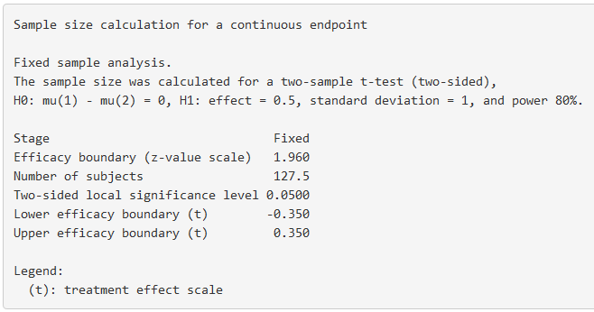

```{r setup, include=FALSE}
library(rpact)
library(papaja)
knitr::opts_chunk$set(echo = TRUE)
```

The R package 'rpact'has been developed to design sequential and adaptive experiments. Many of the functions of the R package are available in an online [Shiny app](https://shiny.rpact.com). For more information about `rpact`, including a quick start guide and manual, visit the [rpact website](https://www.rpact.org/). This step by step vignette accompanies the manuscript "Group Sequential Designs: A Tutorial" by Lakens, Pahlke, & Wassmer (2021).

## Exploring the user interface of rpact

The online shiny app for `rpact` is available at https://shiny.rpact.com. The default settings when the Shiny app is loaded is for a fixed sample design, which means that there is only one look at the data (kMax = 1). In other words, the default setting is not for a sequential design, but a traditional design where the data is analyzed once. Moving the slider for the "Maximum number of stages" would increase the number of looks in the design (you can select up to up to 10 looks). 

```{r tut-1, echo=FALSE, fig.cap="Screenshot of the default settings in the design tab of the rpact Shiny app."}

```

The `rpact` package focuses on Confirmatory Adaptive Clinical Trial Design and Analysis. In clinical trials, researchers mostly test directional predictions, and thus, the default setting is to perform a one-sided test. Outside of clinical trials, it might be less common to design studies testing a directional prediction, but it is often a good idea. In clinical trials, it is common to use a 0.025 significance level (or type I error rate) for one-sided tests, as it is deemed preferable in regulatory settings to set the type I error rate for one-sided tests at half the conventional type I error used in two-sided tests. In other fields, such as psychology, researchers typically use a 0.05 significance level, regardless of whether they perform a one-sided or two-sided test. A default 0.2 Type 2 error rate (or power of 0.8) is common in many fields, and the default setting for the Type II error rate. 

Remember that you always need to justify your error rates – the defaults are most often not optimal choices in any real-life design (and it might be especially useful to choose a higher power, if possible).

## Type I Error Rate Control in Sequential Designs

We can explore a group sequential design by moving the slider for the maximum number of stages to, say, kMax = 2. The option to choose a design appears above the slider in the form of three "Design" radio buttons (Group Sequential, Inverse Normal, and Fisher), which by default is set to a group sequential design – this is the type of designs we will focus on in this step by step tutorial. The other options are relevant for adaptive designs which we will not discuss here. 

A new drop down menu has appeared below the box to choose a Type II error rate that asks you to specify the "Type of design". This allows you to choose how you want to control the alpha level across looks. By default the choice is an O’Brien-Fleming design. Set the Type of Design to the Pocock (P) option. Note there is also a Pocock type alpha spending (asP) option – we will use that later. 

Because most people in social sciences will probably have more experience with two-sided tests at an alpha of 0.05, choose a two-sided test and an alpha level of 0.05 choose those settings. The input window should now look like the example below:  

```{r tut-2, echo=FALSE, fig.cap="Screenshot of the default settings in the design tab of the rpact Shiny app."}

```

Click on the ‘plot’ tab. The first plot in the drop down menu shows the boundaries at each look. The critical *z* score at each look it presented, as is a reference line at z = 1.96 and z = -1.96. These reference lines are the critical value for a two-sided test with a single look (i.e., a fixed design) with an alpha of 5%. We see that the boundaries on the *z* scale have increased. This means we need to observe a more extreme *z* score at an analysis to reject $H_0$. Furthermore, we see that the critical bounds are constant across both looks. This is exactly the goal of the Pocock correction: The alpha level is lowered so that the alpha level is the same at each look, and the overall alpha level across all looks at the data is controlled at 5%. It is conceptually very similar to the Bonferroni correction. We can reproduce the design and the plot in R using the following code:

```{r, echo = TRUE}
design <- getDesignGroupSequential(
  kMax = 2,
  typeOfDesign = "P",
  alpha = 0.05,
  sided = 2
)

plot(design, type = 1)
```

In the dropdown menu, we can easily change the Type of Design from Pocock (P) to O’Brien-Fleming (OF) to see the effect of using different corrections for the critical values across looks in the plot. We see that the O’Brien-Fleming correction has a different goal. The critical value at the first look is very high (which also means the alpha level for this look is very low), but the critical value at the final look is extremely close to the unadjusted critical value of 1.96 (or the alpha level of 0.05). 

```{r, echo = TRUE}
design <- getDesignGroupSequential(
  kMax = 2,
  typeOfDesign = "OF",
  alpha = 0.05,
  sided = 2
)

plot(design, type = 1)
```

We can plot the corrections for different types of designs for each of 3 looks (2 interim looks and one final look) in the same plot in R. The plot below shows the Pocock, O’Brien-Fleming, Haybittle-Peto, and Wang-Tsiatis correction with $\Delta$ = 0.25. We see that researchers can choose different approaches to spend their alpha level across looks. Researchers can choose to spend their alpha conservatively (keeping most of the alpha for the last look), or more liberally (spending more alpha at the earlier looks, which increases the probability of stopping early for many true effect sizes). 

```{r, echo = TRUE}
# Comparison corrections
d1 <- getDesignGroupSequential(typeOfDesign = "OF", sided = 2, alpha = 0.05)
d2 <- getDesignGroupSequential(typeOfDesign = "P", sided = 2, alpha = 0.05)
d3 <- getDesignGroupSequential(typeOfDesign = "WT", deltaWT = 0.25, 
      sided = 2, alpha = 0.05)
d4 <- getDesignGroupSequential(typeOfDesign = "HP", sided = 2, alpha = 0.05)

designSet <- getDesignSet(designs = c(d1, d2, d3, d4), variedParameters = "typeOfDesign")

plot(designSet, type = 1, legendPosition = 5)
```

Because the statistical power of a test depends on the alpha level (and the effect size and the sample size), this means that at the final look the statistical power of an O’Brien-Fleming or Haybittle-Peto design is very similar to the statistical power for a fixed design with only one look. If the alpha is lowered, the sample size of a study needs to be increased to maintain the same statistical power at the last look. Therefore, the Pocock correction requires a remarkably larger increase in the maximum sample size than the O’Brien-Fleming of Haybittle-Peto correction. We will discuss these issues in more detail when we consider sample size planning below.

If you head to the ‘Report’ tab, you can download an easily readable summary of the main results. Here, you can also see the alpha level you would use for each look at the data (e.g., p < 0.0052, and p < 0.0480 for a O’Brien-Fleming type design with 2 looks). 

```{r tut-3, echo=FALSE, fig.cap="Screenshot of the default settings in the design tab of the rpact Shiny app."}

```

Corrected alpha levels can be computed to many digits, but this quickly reaches a level of precision that is meaningless in real life. The observed Type I error rate for all tests you will do in your lifetime is not noticeably different if you set the alpha level at 0.0194, 0.019, or 0.02 (see the concept of ‘[significant digits](https://en.wikipedia.org/wiki/Significant_figures)'. Even as we calculate and use alpha thresholds up to many digits in sequential tests, the messiness of most research makes these alpha levels have [false precision](https://en.wikipedia.org/wiki/False_precision). Keep this in mind when interpreting your data.

Note that the rpact shiny app usefully shows the R code required to reproduce the output. 
```{r tut-4, echo=FALSE, fig.cap="Screenshot of the R command required to reproduce the output."}

```

```{r, echo = TRUE}
design <- getDesignGroupSequential(
  typeOfDesign = "OF",
  informationRates = c(0.5, 1),
  alpha = 0.05,
  beta = 0.2,
  sided = 2
)

summary(design)
```
# Alpha spending functions

An important contribution to the sequential testing literature was made by Lan and DeMets (1983) who proposed the alpha spending function approach. In the Figure below the O'Brien-Fleming-like alpha spending function is plotted against the discrete O'Brien-Fleming bounds. We see the two approaches are not identical, but they are very comparable. The main benefit of these spending functions is that the error rate of the study can be controlled, while neither the number nor the timing of the looks needs to be specified in advance. This makes alpha spending approaches much more flexible. When using an alpha spending function it is important that the decision to perform an interim analysis is not based on collected data, as this can still can increase the Type I error rate.

```{r, echo = TRUE}
d1 <- getDesignGroupSequential(typeOfDesign = "P", kMax = 5)
d2 <- getDesignGroupSequential(typeOfDesign = "asP", kMax = 5)
d3 <- getDesignGroupSequential(typeOfDesign = "OF", kMax = 5)
d4 <- getDesignGroupSequential(typeOfDesign = "asOF", kMax = 5)

designSet <- getDesignSet(designs = c(d1, d2, d3, d4), 
             variedParameters = "typeOfDesign")
plot(designSet, type = 1)
```

# Updating boundaries during a study

Although alpha spending functions control the Type I error rate even when there are deviations from the pre-planned number of looks, or their timing, this does require recalculating the boundaries used in the statistical test based on the amount of information that has been observed. Let us assume a researcher designs a study with three equally spaced looks at the data (two interim looks, one final look), using a Pocock-type spending function, where results will be analyzed in a two-sided t-test with an overall desired Type I error rate of 0.05, and a desired power of 0.9 for a Cohen’s d of 0.5. An a-priori power analysis (which we will explain later in this tutorial) shows that we achieve the desired power in our sequential design if we plan to look after 65.4, 130.9, and 196.3 observations in each condition. Since we cannot collect partial participants, we should round these numbers up, and because we have 2 independent groups, we will collect 66 observations for look 1 (33 in each condition), 132 at the second look (66 in each condition) and 198 at the third look (99 in each condition). 

```{r, echo = TRUE}
design <- getDesignGroupSequential(
  kMax = 3,
  typeOfDesign = "asP",
  sided = 2,
  alpha = 0.05,
  beta = 0.1
)

summary(design)

sampleSizeResult <- getSampleSizeMeans(
  design = design,
  groups = 2,
  alternative = 0.5,
  stDev = 1
)

summary(sampleSizeResult)
```

Now imagine that due to logistical issues, we do not manage to analyze the data until we have collected data from 76 observations (38 in each condition) instead of the planned 66 observations. So our first look at the data does not occur at 33.3% of planned sample, but at 76/198 = 38.4% of the planned sample. We can recalculate the alpha level we should use for each look at the data, based on the current look, and planned future looks. Instead of using the alpha levels 0.0226, 0.0217, and 0.0217 at the three respective looks (as indicated above in the summary of the originally planned design), we can adjust the information rates in the Shiny app (Double click on a cell to edit it; hit Ctrl+Enter to finish editing, or Esc to cancel): 

```{r tut-5, echo=FALSE, fig.cap="Screenshot of the default information rates (above) and adapted information rates (below)."}

```

The updated alpha levels are 0.0253 for the current look, 0.0204 for the second look, and 0.0216 for the final look. To compute updated bounds in R directly, we can use the code: 

```{r, echo = TRUE}
design <- getDesignGroupSequential(
  typeOfDesign = "asP", 
  informationRates = c(76/198, 2/3, 1), 
  alpha = 0.05, 
  sided = 2)
summary(design)
```

It is also possible to correct the alpha level if the final look at the data changes, for example because you are not able to collect the intended sample size, or because due to unforeseen circumstances you collect more data than planned. If this happens, we can no longer use the alpha spending function we chose, and instead have to provide a user-defined alpha spending function by updating the timing and alpha spending function to reflect the data collection as it actually occurred up to the final look. 

Assuming the second look in our earlier example occurred as originally planned, but the last look occurred at 206 participants instead of 198 we can compute an updated alpha level for the last look. Given the current total sample size, we need to recompute the alpha levels for the earlier looks, which now occurred at 72/206 = 0.369, 132/206 = 0.641, and for the last look at 206/206 = 1. 

Because the first and second look occurred with the adjusted alpha levels we computed after the first adjustment (alpha levels of 0.0253 and 0.0204) we can look at the "Cumulative alpha spent' row and see how much of our Type I error rate we spent so far (0.0253 and 0.382). We also know we want to spend the remainder of our Type I error rate at the last look, for a total of 0.05. 

Our actual alpha spending function is no longer captures by the Pocock spending function after collecting more data than planned, but instead, we have a user defined spending function. We can enter both the updated information rates and the final alpha spending function directly in the Shiny app by selecting the ‘User defined alpha spending (asUser)' function: 

```{r tut-7, echo=FALSE, fig.cap="Screenshot of a user defined alpha spending function."}

```

The output shows the computed alpha level for this final look is 0.0210 instead of 0.0216. The difference is very small in this specific case, but might be larger depending on the situation. This example shows the flexibility of group designs when alpha spending functions are used. We can also perform these calculations in R directly: 

```{r, echo = TRUE}
design <- getDesignGroupSequential(
  typeOfDesign = "asUser", 
  informationRates =
  c(72/206, 132/206, 1), 
  alpha = 0.05, 
  sided = 2, userAlphaSpending = c(0.0253, 0.0382, 0.05)
)
summary(design)
```

# Power analysis for group sequential designs

We will once again start with the default settings of the Shiny app which is for a fixed design with one look. Click on the ‘Endpoint’ tab to choose how you want to specify the desired endpoint in this study. We will assume we plan to perform a *t* test, and therefore, that our endpoint is based on the means we observe. 

```{r tut-8, echo=FALSE, fig.cap="Screenshot of a user defined alpha spending function."}

```

Then click the ‘Trial Settings’ tab. Here, you can specify if you want to calculate the required sample size (to achieve a desired power) or compute the expected power (based on a chosen sample size). By default, the calculation will be for a two-group (independent) *t* test. 

The same number of individuals are collected in each group (allocation ratio = 1). It is possible to choose to use a normal approximation (which some software programs use) but the default settings where the calculations are based on the *t* distribution, will be (ever so slightly) more accurate. 

The effect under the null hypothesis $H_0$ is 0 by default, and the effect under the alternative is 0.2, and the default standard deviation is 1. This means that by default the power analysis is for a standardized effect size of Cohen’s d = 0.2/1 = 0.2. That is a small effect. In this example we will assume a researcher is interested in detecting a somewhat more substantial effect size, a mean difference of 0.5. Change the effect under the alternative to 0.5. Note that it is possible to compute the power for multiple values by selecting a value larger than 1 in the "# values" dropdown menu (but we will calculate power for a single alternative for now). 

We can also directly perform these calculations in R: 

```{r, echo = TRUE}
design <- getDesignGroupSequential(
  kMax = 1, 
  alpha = 0.05, 
  sided = 2)

summary(getSampleSizeMeans(design, alternative = 0.5))
```

```{r tut-9, echo=FALSE, fig.cap="Screenshot of the input for a two-group design with an expected effect size of d = 0.5."}
knitr::include_graphics("tut_images/tut_9.png")
```

```{r tut-10, echo=FALSE, fig.cap="Screenshot of the output of a power analysis for a fixed design."}

```

These calculations show that for a fixed design we should collect 128 participants (64 in each condition) to achieve 80% power for a Cohen's d of 0.5 (or a mean difference of 0.5 with an expected population standard deviation of 1). 

This result is similar to what can be computed in power analysis software for non-sequential designs, such as G*power. 

```{r tut-11, echo=FALSE, fig.cap="Screenshot of the output of a power analysis in G*Power."}

```

# Sample Sizes and Power across looks

(We will now look at power in a sequential design. Change the slider for the number of looks (kMax) to 3. Furthermore, change the Type II error rate to 0.1 (a default of 0.2 is, regardless of what Cohen thought, really a bit large).  By default `rpact` assumes we will look at the data at equal times – after 33%, 67%, and 100% of the data is collected. The default design is an O'Brien-Fleming design, with a one-sided test. Set the alternative hypothesis in the 'trials setting' tab to 0.5. We can compute the sample size we would need for a sequential group design to achieve the desired error rates for a specified alternative using the `getSampleSizeMeans()` function in R. 
))
```{r}
seq_design_of <- getDesignGroupSequential(
  kMax = 3,
  typeOfDesign = "OF",
  sided = 1,
  alpha = 0.05,
  beta = 0.1
  )

# Compute the sample size we need
power_res_of <- getSampleSizeMeans(
  design = seq_design_of,
  groups = 2,
  alternative = 0.5, 
  stDev = 1, 
  allocationRatioPlanned = 1,
  normalApproximation = FALSE)

summary(power_res_of)
```

The same output is available in the shiny app under the 'Sample Size' tab. 

```{r tut-12-pow, echo=FALSE, fig.cap="Summary of power analysis for an O'Brien-Fleming design with 3 looks and a one-sided test with alpha = 0.05.", out.width = "480px"}

```

This output shows that at the first look, with a very strict alpha level of 0.0015, we will have almost no power. Even if there is a true effect of d = 0.5, in only 10.55% of the studies we run will we be able to stop after collecting 33% of the data has been collected (as we see in the row "Overall power" or "Cumulative Power"). One might wonder whether it would even be worth looking at the data at this time point (the answer might very well be ‘no’, and it is not necessary to design equally spaced looks). At the second look overall power is 62.95%, which gives us a reasonable chance to stop if there is an effect, at the the final look it should be 90%, as this is what we designed the study to achieve. We can also print the full results (instead of just a summary), or select 'Details' in the Shiny app: 

```{r}
power_res_of
```

We see that the maximum number of subjects we would need to collect is 141.8, or rounded up, 142. The expected number of subjects under $H_0$ (when there is no true effect) is 140.9 - we will almost always collect data up to the third look, unless we make a Type I error and stop at the first two looks. 

The expected number of subjects under $H_1$ (i.e., d = 0.5) is 107.1. If there is a true effect of d = 0.5, we will stop early in some studies, and therefore the average expected sample size is lower than the maximum. 

We can plot the results across a range of possible effect sizes: 

```{r}
sample_res_plot <- getPowerMeans(
  design = seq_design_of,
  groups = 2,
  alternative = seq(0,1,0.01), 
  stDev = 1, 
  allocationRatioPlanned = 1,
  maxNumberOfSubjects = 142, #rounded up
  normalApproximation = FALSE)

# code for plot (not run, we show an annotated version of this plot)
# plot(sample_res_plot, type = 6, legendPosition = 6)
```

```{r tut-12, echo=FALSE, fig.cap="Plot of power and average expected sample size for an O'Brien-Fleming design with 3 looks.", out.width = "480px"}

```

To create this plot in the Shiny app, you need to specify the design, in the endpoint tab select 'Means', and in the trial settings select 'Power' as the calculation target, two groups, and for the number of values, select 50 from the drop-down menu. Specify the lower (i.e., 0) and upper (i.e., 1) value of the mean difference (given the standard deviation of 1, these values will also be Cohen's d effect sizes). The maximum number of subjects is set to 142 (based on the power analysis we performed above). Go to the 'Plot' tab and select the 'Sample Size[6]' plot. 

```{r tut-12-shiny, echo=FALSE, fig.cap="Screenshot of power and average expected sample size for an O'Brien-Fleming design with 3 looks in the Shiny app.", out.width = "480px"}

```

If you click on the ‘plot’ tab and select the Average Sample size and Power / Early stop graph, and set the max sample size (nMax) to 50, you see that depending on the true effect size, there is a decent probability of stopping early (blue line) compared to at the final look (green line). Furthermore, the larger the effect size, the lower the Average sample size will be (red line).

Without sequential analyses we would collect 50 participants (the maximum sample size specified). But when the true effect size is large, we have a high probability to stop early, and the sample size that one needs to collect will on average (in the long run of doing many sequential designs) be lower. 

After this general introduction to the benefits of group sequential designs to efficiently design well powered studies, we will look at more concrete examples of how to perform an a-priori power analysis for sequential designs.

# A-priori power analysis in sequential designs

When designing a study where the goal is to test whether a specific effect can be statistically rejected researchers often want to make sure their sample size is large enough to have sufficient power to for an effect size of interest. This is done by performing an a-priori power analysis. Given a specified effect size, alpha level, and desired power, an a-priori power analysis will indicate the number of observations that should be collected.

An informative study has a high probability of correctly concluding an effect is present when it is present, and absent when it is absent. An a-priori power analysis is used to choose a sample size to achieve desired Type I and Type II error rates, in the long run, given assumptions about the null and alternative model. 

We will assume that we want to design a study that can detect a difference of 0.5, with an assumed standard deviation in the population of 1, which means the expected effect is a Cohen’s d of 0.5. If we plan to analyze our hypothesis in a one-sided *t* test (given our directional prediction), set the overall alpha level to 0.05, and want to achieve a Type II error probability of 0.1 (or a power of 0.9). Finally, we believe it is feasible to perform 2 interim analyses, and one final analysis (e.g., collect the data across three weeks, and we are willing to stop the data collection after any Friday). How many observations would we need? 

The decision depends on the final factor we need to decide in a sequential design: the alpha spending function. We can choose an alpha spending function as we design our experiment, and compare different choices of a spending function. We will start by examining the sample size we need to collect if we choose an O’Brien-Fleming alpha spending function. 

<!-- ```{r tut-13, echo=FALSE, fig.cap="Screenshot of the output of a power analysis in G*Power."} -->
<!--  -->
<!-- ``` -->

On the ‘Endpoint’ tab we specify means. Then we move to the ‘Trial Design’ tab. It is easy in `rpact` to plot power across a range of effect sizes, by selecting multiple values from the dropdown menu (i.e., 5). We set 0.3 and 0.7 as the lower and upper value, and keep the standard deviation at 1, so that we get the sample sizes for the range of Cohen’s d 0.3 to 0.7. 

Sometimes you might have a clearly defined effect size to test against – such as a theoretically predicted effect size, or a smallest practically relevant effect size. Other times, you might primarily know the sample size you can achieve to collect, and you want to perform a sensitivity analysis, where you examine which effect size you can detect with a desired power, given a certain sample size. Plotting power across a range of effect sizes is typically useful. Even if you know which effect size you expect, you might want to look at what would be the consequences of the true effect size being slightly different than expected. 

```{r tut-14, echo=FALSE, fig.cap="Screenshot of trial settings tab in the Shiny app where power is plotted for a range of 5 effect sizes under the alternative hypothesis ranging from 0.3 to 0.7."}

```

In the results tabs, click on ‘plot’ and from the dropdown menu select ‘sample size [5]’. You will see a plot like the one below, created with the R package. From the results (in the row "Maximum number of subjects"), we see that if the true effect size is indeed d = 0.5, we would need to collect at most 141 participants (the result differs very slightly from the power analysis reported above, as we use the O'Brien-Fleming alpha spending function, and not the O'Brien-Fleming correction). In the two rows below, we see that this is based on 71 (rounded up) participants in each condition, so in practice we would actually collect a total of 142 participants due to upward rounding within each condition. 

```{r, echo = TRUE}
design <- getDesignGroupSequential(typeOfDesign = "asOF", 
                                   alpha = 0.05, 
                                   beta = 0.1)
sample_res <- (getSampleSizeMeans(design, alternative = c(0.3, 0.4, 0.5, 0.6, 0.7)))

plot(sample_res, type = 5, legendPosition = 4)
```

This maximum is only slightly higher than if had user a fixed design. For a fixed design (which you can examine by moving the slider for the maximum number of stages back to 1), we would need to collect 69.2 participants, or 138.4 in total, while for a sequential design, the maximum sample size per condition is 70.5. 

The difference between a fixed design and a sequential design can be calculated by looking at the 'inflation factor'. We can find the inflation factor for the sequential design in the 'characteristics' in the design tab (select for the R output Details + characteristics, or Summary + details + characteristics) which is 1.0187. In other words, the maximum sample size increased to 69.2 x 1.0187 = 70.5 per condition. The inflation is essentially caused by the reduction in the alpha level at the final look, and differs between designs (e.g., for a Pocock type alpha spending function, the inflation factor for the current design is larger, namely 1.1595)

However, the maximum sample size is not the expected sample size for this design, because of the possibility that we can stop data collection at an earlier look in the sequential design. In the long run, if d = 0.5, and we use an O'Brien-Fleming alpha spending function, and ignoring upward rounding because we can only collect a complete number of observations, we will sometimes collect 47 participants and stop after the first look see the row "Number of subjects [1]"), sometimes 94 and stop after the second look (see the row "Number of subjects [2]")), and sometimes 141 and stop after the last look (see the row "Number of subjects [1]")). 

As we see in the row 'Exit probability for efficacy (under H1)' we can stop early 6.75% of the time after look 1, 54.02% after look two, and in the remaining cases we will stop 1 - (0.0675 + 0.5402) = 39.23% of the time at the last look. 

This means that, assuming there is a true effect of d = 0.5, the *expected* sample size on average is the probability of stopping at each look, multiplied by the number of observations we collect at each look, so 0.0675 * 47.0 + 0.5402 * 94.0 + ((1 - (0.0675 + 0.5402)) * 141.0) = 109.3, which matches the row "Expected number of subjects under H1" (again, assuming the alternative hypothesis of d = 0.5 is correct). So, in any single study we might need to collect slightly more data than in a fixed design, but on average we will need to collect less observations in a sequential design, namely 109.3, instead of 138.4 in a fixed design (assuming the alternative hypothesis is true). 

```{r, echo = TRUE}
design <- getDesignGroupSequential(typeOfDesign = "asOF", alpha = 0.05, beta = 0.1)
# getDesignCharacteristics(design)$inflationFactor
sample_res <- (getSampleSizeMeans(design, alternative = c(0.5)))
sample_res
```

For a Pocock alpha spending function the maximum sample size is larger (you can check by changing the spending function). The reason is that the alpha level at the final look is lower for a Pocock spending function than for the O’Brien-Fleming spending function, and the sample size required to achieve a desired power is thus higher. However, because the alpha level at the first look is higher, there is a higher probability of stopping early, and therefore the expected sample size is lower for a Pocock spending function (97.7 compared to 109.3). It is up to a researcher to choose a spending function, and weigh how desirable it would be to stop early, given some risk in any single study of increasing the sample size at the final look. For these specific design parameters, the Pocock alpha spending function might be more efficient on average, but also more risky in any single study. 

# Stopping for futility

So far, the sequential design would only stop at an interim analysis if we can reject $H_0$. It is also possible to stop for futility, for example, based on a beta-spending function. We can directly compare the previous design with a design where we stop for futility. Just as we are willing to distribute our Type I error rate across interim analyses, we can distribute our Type II error rate across looks, and decide to stop for futility when we can reject the presence of an effect at least as large as 0.5, even if we are then making a Type II error. 

If there actually is no effect, such designs are more efficient. One can choose in advance to stop data collection when the presence of the effect the study was designed to detect can be rejected (i.e., binding beta-spending), but it is typically recommended to allow the possibility to continue data collection (i.e., non-binding beta-spending). Adding futility bounds based on beta-spending functions reduce power, and increase the required sample size to reach a desired power, but this is on average compensated by the fact that studies stop earlier due to futility, which can make designs more efficient.

```{r tut-15, echo=FALSE, fig.cap="Screenshot of the rpact input for an beta-spending function."}

```

When an alpha spending function is chosen in the rpact Shiny app, a new drop drown menu appears that allows users to choose a beta-spending function. In the R package, we simply add `typeBetaSpending = "bsOF"` to the specification of the design. You do not need to choose the same spending approach for alpha and beta as is done in this example.

```{r}
design <- getDesignGroupSequential(typeOfDesign = "asOF", 
          alpha = 0.05, beta = 0.1, typeBetaSpending = "bsOF")
sample_res <- (getSampleSizeMeans(design, alternative = 0.5))
sample_res
```

We see that with a beta-spending function the Expected number of subjects under H1 has increased from 109.3 to 111.0. The maximum number of subjects has increased from 141 to 148.2. So, if the alternative hypothesis is true, stopping for futility comes at a cost. However, it is possible that $H_0$ is true. 

At the last look in our sequential design, which we designed to have 90% power, we are willing to act as if $H_0$ is true with a 10% error rate. We can reverse the null and alternative hypothesis, and view the same decision process as an equivalence test. In this view, we test whether we can reject the presence of a meaningful effect. For example, if our smallest effect size of interest is a mean difference of 0.5, and we observe a mean difference that is surprisingly far away from 0.5, we can reject the presence of an effect that is large enough to care about. In essence, in such an equivalence test the Type II error of the original null hypothesis significance test has now become the Type I error rate. Because we have designed our null hypothesis significance test to have 90% power for a mean difference of 0.5, 10% of the time we would incorrectly decide to act as if an effect of at least 0.5 is absent. This is statistically comparable to performing an equivalence test with an alpha level of 10%, and decide to act as if we can reject the presence of an effect at least as large as 0.5, which should also happen 10% of the time, in the long run. 

If we can reject the presence of a meaningful effect, whenever $H_0$ is true, at an earlier look, we would save resources when $H_0$ is true. We see that the expected number of subjects under $H_0$ was 140.2. In other words, when $H_0$ is true, we would continue to the last look most of the time (unless we made a Type 1 error at look 1 or 2). With a beta-spending function, the expected number of subjects under $H_0$ has decreased substantially, to 99.6. The choice of whether you want to use a beta-spending function depends on the goals of your study. If you believe there is a decent probability $H_0$ is true, and you would like to efficiently conclude this from the data, the use of a beta-spending approach might be worth considering. 

# Reporting the results of a sequential analysis

A challenge when wanting to interpret the observed effect size is that whenever a study is stopped early when rejecting $H_0$, there is a risk that we stopped because due to random variation we happened to observe a large effect size at the time of the interim analysis. This which means that the observed effect size at these interim analyses over-estimates the true effect. 

A similar issue is at play when reporting *p* values and confidence intervals. When a sequential design is used, the distribution of a *p* value that does not account for the sequential nature of the design is no longer uniform when $H_0$ is true. A *p* value is the probability of observing a result at least as extreme as the result that was observed, given that $H_0$ is true. It is no longer straightforward to determine what ‘at least as extreme’ means a sequential design (Cook, 2002). It is possible to compute adjusted effect size estimates, confidence intervals, and *p* values in `rpact`. This currently cannot be done in the Shiny app. 

```{r, results = 'hide', echo = FALSE}

seq_design <- getDesignGroupSequential(
  kMax = 3,
  typeOfDesign = "asP",
  sided = 2,
  alpha = 0.05,
  beta = 0.1
)

power_res <- getSampleSizeMeans(
  design = seq_design,
  groups = 2,
  alternative = 0.5,
  stDev = 1,
  allocationRatioPlanned = 1,
  normalApproximation = FALSE
)

# Rounded up, we have 3 looks at 66 observations in TOTAL (33 per condition)
# Note, we have to enter the means and sd for each stage
# So for the second look, the 66 observations from look 1
# Alternatively use overallN1 to define samples, see help file

set.seed(6883)
x1 <- rnorm(33, 0.45, 1.1)
x2 <- rnorm(33, 0.45, 1.1)
x3 <- rnorm(33, 0.45, 1.1)
y1 <- rnorm(33, 0, 1.1)
y2 <- rnorm(33, 0, 1.1)
y3 <- rnorm(33, 0, 1.1)

# Overall p-values (combining all data at each look)
test_1 <- t.test(x1,y1, var.equal = TRUE)
test_2 <- t.test(c(x1,x2),c(y1,y2), var.equal = TRUE)
test_3 <- t.test(c(x1,x2,x3),c(y1,y2,y3), var.equal = TRUE)

# Stage result p-values
test_4 <- t.test(x1,y1, var.equal = TRUE)
test_5 <- t.test(x2,y2, var.equal = TRUE)
test_6 <- t.test(x3,y3, var.equal = TRUE)

data_means <- getDataset(
  n1 = c(33,33,33), 
  n2 = c(33,33,33), 
  means1 = c(mean(x1), mean(x2), mean(x3)), #for directional test, means 1 > means 2
  means2 = c(mean(y1), mean(y2), mean(y3)),
  stDevs1 =c(sd(x1), sd(x2), sd(x3)), 
  stDevs2 =c(sd(y1), sd(y2), sd(y3))
  )


res <- getAnalysisResults(
  seq_design,
  equalVariances = TRUE,
  dataInput = data_means,
  thetaH1 = 0.5,
  assumedStDev = 1
  )

my_apa_print <- function(x) {
  sub('\\$p = \\.', '$p = 0.', apa_print(x)[3])
}
```

Imagine we have performed a study planned to have at most 3 equally spaced looks at the data, where we perform a two-sided test with an alpha of 0.05, and we use a Pocock type alpha spending function, and we observe mean differences between the two conditions of `r my_apa_print(test_1)` at stage 1, `r my_apa_print(test_2)` at stage 2, and `r my_apa_print(test_3)` at the last look. Based on a Pocock-like alpha spending function with three equally spaced looks the alpha level at each look for a two-sided *t*-test is `r format(seq_design$stageLevels[1]*2, nsmall = 4, digits = 4)`, `r format(seq_design$stageLevels[2]*2, nsmall = 4, digits = 4)`, and `r format(seq_design$stageLevels[3]*2, nsmall = 4, digits = 4)`. We can thus reject $H_0$ after look `r res$finalStage`. But we would also like to report an effect size, and adjusted *p* values and confidence intervals. 

The first step is to create a dataset with the results at each look, consisting of the sample sizes, means, and standard deviations. Note that these are the sample sizes, means, and standard deviations only based on the data at each stage. In other words, we compute the means and standard deviations of later looks by excluding the data in earlier looks, so every mean and standard deviation in this example is based on 33 observations in each condition. 

```{r, echo = TRUE}
data_means <- getDataset(
  n1 = c(33,33,33), 
  n2 = c(33,33,33), 
  means1 = c(0.6067868, 0.2795294, 0.7132186),
  means2 = c(0.01976029, 0.08212538, 0.08982903),
  stDevs1 =c(1.135266, 1.35426, 1.013671), 
  stDevs2 =c(1.068052, 0.9610714, 1.225192)
)

summary(data_means)
```

We then take our design: 

```{r}
seq_design <- getDesignGroupSequential(
  kMax = 3,
  typeOfDesign = "asP",
  sided = 2,
  alpha = 0.05,
  beta = 0.1
)
```

and compute the results based on the data we entered: 

```{r}
res <- getAnalysisResults(
  seq_design,
  equalVariances = FALSE,
  dataInput = data_means,
  thetaH1 = 0.5,
  assumedStDev = 1
)
```

We can then print a summary of the results: 

```{r}
summary(res)
```

The results show that the action after look 1 and 2 was to continue data collection, and that we could reject $H_0$ at the third look. The unadjusted mean difference is provided in the row "Overall effect size" and at the final look this was `r round(res$.stageResults$effectSizes[3], 3)`. The adjusted mean difference is provided in the row "Median unbiased estimate" and is lower, and the adjusted confidence interval is in the row "Final confidence interval", giving the result `r round(res$medianUnbiasedEstimates[3], 3)`, 95% CI [`r round(res$finalConfidenceIntervalLowerBounds[3], 3)`, `r round(res$finalConfidenceIntervalUpperBounds[3], 3)`]. 

The unadjusted *p* values for a one-sided tests are reported in the row "Overall p-value". The actual *p* values for our two-sided test would be twice as large, so `r res$.stageResults$overallPValues*2`. The adjusted *p*-value at the final look is provided in the row "Final p-value" and it is `r format(res$finalPValues[3], nsmall = 4, digits = 4)`. 

# Conditional power analysis

The probability of finding a significant result, given the data that have been observed up to an interim analysis, is called *conditional power*. This approach can be useful in adaptive designs - designs where the final sample sizes is updated based on an early look at the data. In *blinded* sample size recalculation no effect size is calculated at an earlier look, but other aspects of the design, such as the standard deviation, are updated. In an *unblinded* sample size recalculation, the effect size estimate at an early look is used to determine the final sample size. 

Let us imagine that we perform a sequential design using a Pocock alpha and beta spending function: 

```{r}
seq_design <- getDesignGroupSequential(
  sided = 1,
  alpha = 0.05,
  beta = 0.1,
  typeOfDesign = "asP",
  typeBetaSpending = "bsP",
  bindingFutility = FALSE
)
```

We perform an a-priori power analysis based on a smallest effect size of interest of d = 0.38, which yields a maximum number of subjects of 330. 

```{r}
power_res <- getSampleSizeMeans(
  design = seq_design,
  groups = 2,
  alternative = 0.38,
  stDev = 1,
  allocationRatioPlanned = 1,
  normalApproximation = FALSE
)

summary(power_res)
```

We first looked at the data after we collected 110 observations. At this time, we observed a mean difference of 0.1. Let us say we assume the population standard deviation is 1, and that we are willing to collect 330 observations in total, as this gave us 90% power for the effect we wanted to detect, a mean difference of 0.5. Given the effect sie we observed, which is smaller than our smallest effect size of interest, what is the probability we will find a significant effect if we continue? We create a dataset: 

```{r}
data_means <- getDataset(
  n1 = c(55),
  n2 = c(55),
  means1 = c(0.1), # for directional test, means 1 > means 2
  means2 = c(0),
  stDevs1 = c(1),
  stDevs2 = c(1)
)
```

and analyze the results: 

```{r}
stage_res <- getStageResults(seq_design,
  equalVariances = TRUE,
  dataInput = data_means
)

summary(stage_res)
```

We can now perform a conditional power analysis based on the data we have observed so far. An important question is which effect size should be entered. Irrespective of the effect size we expected when designing the study, we have observed an effect of d = 0.1, and the smallest effect size of interest was a d = 0.38. We can compute the power under the assumption that the true effect size is d = 0.1 and d = 0.38: 

```{r}
# Compute conditional power after the first look
con_power_1 <- getConditionalPower(
  design = seq_design,
  stageResults = stage_res,
  nPlanned = c(110, 110), # The sample size planned for the subsequent stages.
  thetaH1 = 0.1, # alternative effect
  assumedStDev = 1 # standard deviation
) 

summary(con_power_1)
```

If the true effect size is 0.1, the power is 0.09 at the final look. Under this assumption, there is little use in continuing the data collection. Under the assumption that the smallest effect size of interest would be true:

```{r}
# Compute conditional power after the first look
con_power_2 <- getConditionalPower(
  design = seq_design,
  stageResults = stage_res,
  nPlanned = c(110, 110), # The sample size planned for the subsequent stages. 
  thetaH1 = 0.38, # alternative effect
  assumedStDev = 1 # standard deviation
)

summary(con_power_2)
```

Under the assumption that the smallest effect size of interest exists, there is a reasonable probability of still observing a significant result at the last look (71.26%). 

# Preregistration and downloading a report

Because of the flexibility in choosing the number of looks, and the alpha spending function, it is important to preregister your statistical analysis plan. Preregistration allows other researchers to evaluate the severity of a test – how likely were you to find an effect if it is there, and how likely were you to not find an effect if there was no effect. Flexibility in the data analysis increases the Type 1 error rate, or the probability of finding an effect if there actually isn’t any effect (i.e., a false positive), and preregistering your sequential analysis plan can reveal to future readers that you severely tested your prediction.

The use of sequential analyses gives researchers more flexibility. To make sure this flexibility is not abused, the planned experimental design should be preregistered. The easiest way to do this is by either adding the rpact R code, or when the Shiny app is used, to use the export function and store the planned design as a PDF, RMarkdown, or R file. 

```{r tut-16, echo=FALSE, fig.cap="Screenshot of the option in rpact to export a report of the design."}

```

